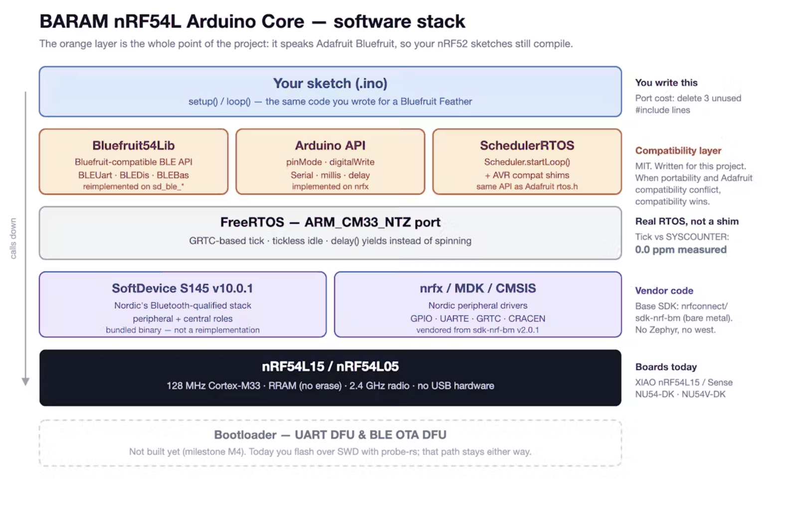
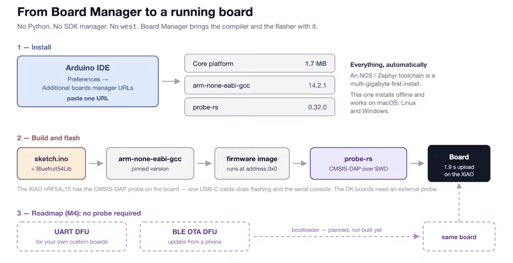

The nRF54L is Nordic's successor to the nRF52. The nRF52 carries one of the
largest bodies of Arduino BLE code in existence — Adafruit's Bluefruit ecosystem
— and none of it carries over on its own. I wrote an Arduino core for the nRF54L
whose first rule is that it should.

## The problem I had

Every other nRF54L Arduino effort I looked at exposes a third, project-specific
BLE API. That is a defensible choice. It also means a working nRF52 sketch gets
rewritten from scratch, and the libraries and examples built around
`Bluefruit.begin()` are worth nothing on the new chip.

So I took the opposite position and wrote it down as a rule the project is not
allowed to break:

> When portability and Adafruit compatibility conflict, compatibility wins.

The goal is that an `.ino` written for a Bluefruit Feather compiles and runs on
an nRF54L board with minimal edits — the same `Bluefruit` API, the same
`Scheduler.startLoop()`, the same `delay()` semantics on top of FreeRTOS.

A second goal shaped just as much of the design: custom boards. Getting firmware
onto a board I built myself, and updating it in the field over UART or BLE,
should not require a debug probe attached to every unit.

## How it is layered



Three things about that stack are deliberate.

**The base is bare metal, not Zephyr.** It sits on
[nrfconnect/sdk-nrf-bm](https://github.com/nrfconnect/sdk-nrf-bm) v2.0.1, the
bare metal option for the nRF54L series. A sketch stays a standalone binary
starting at address 0, which is what makes a UART DFU bootloader straightforward
later. It also keeps the install small and the build decoupled from a large SDK's
release cycle.

**FreeRTOS is not optional.** Bluefruit's `delay()` and
`Scheduler.startLoop()` mean what they mean because there is a scheduler
underneath. Removing it would break the compatibility that the project exists
for, so it is a rule rather than a preference.

**There is no extra abstraction layer.** The Bluefruit API and the Arduino API
are already the seams. A third HAL beneath them would be abstraction for its own
sake, so the core does not have one.

The BLE stack is Nordic's SoftDevice S145 v10.0.1 — peripheral and central,
Bluetooth qualified, not a reimplementation.

## What the choice buys

- **The install is small.** The platform archive is 1.7 MB, and Board Manager
  brings the Arm toolchain and `probe-rs` with it. No Python, no SDK, no `west`.
  An SDK-based toolchain is a multi-gigabyte first install.
- **The timebase holds through sleep.** FreeRTOS runs tickless on a GRTC tick,
  measured at 0.0 ppm against the hardware SYSCOUNTER, so `millis()` stays
  accurate while the chip sleeps.
- **The result is small too.** Blink plus `Serial` plus two tasks builds to
  38,004 B of flash and 3,856 B of RAM.
- **BLE is not a toy subset.** Advertising, a GATT server with custom services,
  `BLEUart`, `BLEDis`, `BLEBas`, ATT MTU 247, scanning and connecting as a
  central, pairing and bonding including LE Secure Connections, HID, BLE-MIDI and
  ANCS. RAM is reserved for five concurrent links on nRF54L15 and three on
  nRF54L05.
- **Four boards, two of them USB-C only.** Both XIAO boards and the NU54V-DK
  carry an onboard CMSIS-DAP probe, so flashing and the serial console need
  nothing but a cable.



There is no Python, no SDK manager and no `west` anywhere in that path, and the
same path works offline once the install is done.

## The part that bites, and what I did about it

On the nRF54L a peripheral is tied to a GPIO port. This is the biggest behavioural
difference from the nRF52, where any pin could take any peripheral. PWM and the
ADC reach P1 only; pin interrupts reach P1 and P0 but never P2; SPI runs on P2 and
each signal has just two possible pins.

Checking the port alone is not enough. `PIN_SPI_SCK = P2.03` passes a port check
and still does not work, because `SPIM00.SCK` is only on P2.01 and P2.06 — and the
only symptom is that SPI is silent.

So the constraint table is checked at compile time. The header is generated from
Nordic's Pin Planner SoC definitions rather than typed by hand:

`nrf54l/cores/nrf54l/nrf54l_pinmap.h`

```c
#define NRF54L_ASSERT_SIG(pin, sig, what) \
    NRF54L_STATIC_ASSERT(NRF54L_SIG_##sig(pin), what " : " NRF54L_TXT_##sig)

#define NRF54L_SIG_SPIM00_SCK(p)  ((p) == 65 || (p) == 70)
#define NRF54L_TXT_SPIM00_SCK     "SPIM/SPIS00.SCK only works on P2.01, P2.06"
```

[Source at commit 9e8226a](https://github.com/chcbaram/baram-nrf54-arduino/blob/9e8226a7196c20178884d42859b023bdaee9e0ec/nrf54l/cores/nrf54l/nrf54l_pinmap.h#L50-L55)

A variant then declares what it expects, and a wrong board definition fails the
build instead of shipping:

`nrf54l/variants/nu54dk/variant.h`

```c
NRF54L_ASSERT_SIG(PIN_SERIAL_TX, UARTE30_TXD, "Serial(UARTE30) TX");
NRF54L_ASSERT_SIG(PIN_SPI_SCK,   SPIM00_SCK,  "SPI SCK");
```

[Source at commit 9e8226a](https://github.com/chcbaram/baram-nrf54-arduino/blob/9e8226a7196c20178884d42859b023bdaee9e0ec/nrf54l/variants/nu54dk/variant.h#L173-L178)

The error message names the pins that would have worked, and the bundled PinMap
examples carry the whole table for each chip and board.

The other migration trap is `analogRead`. The internal reference is 900 mV rather
than the nRF52's 600 mV, and there is no 1/6 gain and no VDD/4 reference.
`AR_DEFAULT` (3.6 V) and `AR_INTERNAL_1_8` are exact; `AR_INTERNAL_3_0` is really
3.15 V, `AR_INTERNAL_2_4` is 2.25 V, and `AR_INTERNAL_1_2` is 1.35 V. Calling
`analogReadMillivolts()` makes all of that go away.

## What this is not

It is not faster or more capable at BLE than a Zephyr/NCS-based core. Those use
Nordic's SoftDevice Controller, the same qualified controller family as the
SoftDevice here. The difference is the API you write against, the size of the
install, and where the project is going — not radio quality.

Zephyr is ahead where I am not playing: Matter, Thread, Zigbee, LE Audio,
802.15.4, MCUboot, TF-M, filesystems, and upstream support for new chips.

The honest long-term risk is that Nordic positions bare metal as a migration path
for nRF5 SDK users and an upgrade route toward Zephyr. It is designed as a bridge,
and a bridge can see its investment taper once it has done its job. That is the
single biggest structural risk in this architecture, and I wrote down the
conditions under which I would revisit it rather than pretending it away.

## Where it stands

Uploading is CMSIS-DAP over SWD driven by `probe-rs` today. UART and BLE OTA DFU
are the next milestone, and the SWD path stays alongside them — a bootloader needs
a recovery route.

## Links

- [baram-nrf54-arduino](https://github.com/chcbaram/baram-nrf54-arduino)
- [Support scope and per-library results](https://github.com/chcbaram/baram-nrf54-arduino/blob/9e8226a7196c20178884d42859b023bdaee9e0ec/docs/LIBRARY-COMPAT.md)
- [nrfconnect/sdk-nrf-bm](https://github.com/nrfconnect/sdk-nrf-bm)

<!--
sources (commit 9e8226a7196c20178884d42859b023bdaee9e0ec):
- README.md — Why this exists, Features, Supported boards, Support scope, How it is built
- CLAUDE.md — §1 rules R7/R11/R12, §2 architecture, §2.1 why bare metal, §2.2 revisit triggers, §3 upload path
- docs/STATUS.md — tickless 0.0 ppm, build size 38004 B / 3856 B, concurrent links
- nrf54l/cores/nrf54l/nrf54l_pinmap.h, nrf54l/variants/nu54dk/variant.h
- 01-software-stack.png, 02-board-manager-flow.png — 저자가 제공한 구조도
-->
