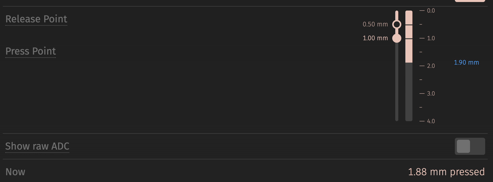

`wish-he` 는 시판 홀이펙트 키보드에 올리는 커스텀 펌웨어다. HPM5361(RISC-V, 400 MHz)
에서 돈다. ADC 스캔이 자석 64개를 숫자 64개로 바꾸고, 곡선이 그걸 밀리미터로 바꾼다. 이
글은 그 둘 위층이다. 깊이를 받아서 눌림인지 뗌인지 정하고, QMK 에 평범한 스위치
매트릭스처럼 보이는 행 비트마스크를 건넨다.

비교 자체는 한 줄이다. 일은 그 앞에 있는 필터와, 무엇에 견주는가와, 문턱을 밀리미터로
적고 나서 그 둘에 벌어진 일에 있다.


## 먼저 잰 것

누르면 값이 **내려간다.** 자석이 가까워지기 때문이다. 16비트 생눈금에서 전 행정이
13,400 카운트, 칸마다 다른 쉬는 값의 폭이 5,800, 안 건드린 키의 피크투피크 잡음이
200 이었다. 행정이 칸 사이 편차의 2.3배라는 것이 여유다. 부팅할 때 눌려 있는 키를
중앙값에 대고 가려낼 수 있게 해 준다.

잡음이 200 이라는 건 하위 4비트가 아무것도 안 나른다는 뜻이기도 하다. 그래서 ADC 다음은
전부 오른쪽으로 4비트 민다. 그 눈금에서 행정이 838, 잡음이 ±6 카운트다.

## 필터 — IIR 을 버리고 데드밴드로

처음에는 1/4 짜리 1차 IIR(이전 값에 새 값을 조금씩 섞는 필터) 을 썼다. 잡음은 분명히
줄었다. 그리고 그 정착 시간이 그대로 입력 지연이 됐다. 63 % 까지 4스캔(152 us),
90 % 까지 9스캔(342 us).

그래서 데드밴드로 바꿨다. 폭보다 큰 변화는 **같은 표본 안에서** 지나가고, 폭 안의
잔물결은 아예 안 지나간다.

`firmware/wish-he/src/hw/driver/keys.c`
([퍼머링크](https://github.com/chcbaram/wish-he/blob/2d5083019c522b35f0fe0d7c4f6d8df51b99d22f/firmware/wish-he/src/hw/driver/keys.c#L1710-L1728))

```c
static inline void keysFilter(uint32_t step, uint32_t ch, uint32_t packed)
{
  uint16_t v12 = (uint16_t)((packed & 0xFFFF) >> KEYS_RAW_SHIFT);
  int32_t  v;
  int32_t  o;

  /* 링을 한 칸 밀어 합을 갱신한다 — 가장 오래된 것을 빼고 새 것을 더한다 */
  v = (int32_t)acc_sum[step][ch] - (int32_t)acc_hist[step][ch][acc_idx] + (int32_t)v12;
  acc_hist[step][ch][acc_idx] = v12;
  acc_sum[step][ch]           = (uint16_t)v;

  /* 데드밴드는 합 눈금에 건다 */
  o = (int32_t)raw[step][ch];

  if      (v > o + KEYS_DEADBAND) o = v - KEYS_DEADBAND;
  else if (v < o - KEYS_DEADBAND) o = v + KEYS_DEADBAND;

  raw[step][ch] = (uint16_t)o;
}
```

두 축이 한꺼번에 좋아졌다. 피크투피크 잡음이 9~16 에서 1~10 으로, 지연이 152/342 us
에서 0 으로. 그리고 같은 속도로 눌렀을 때 도달하는 깊이가 -652 에서 -832 가 됐다.
행정이 838 인데 말이다.

마지막 숫자가 증거다. IIR 아래에서 나는 행정의 78 % 만 보고 있었다. `keys map` 에서
보고 흐뭇해하던 매끄러운 곡선은 내 손가락 모양이 아니라 **필터의 모양** 이었다.

그때 키 하나의 지연 예산은 이랬다. 스캔 한 바퀴 실측 38 us, 필터 **0**, 8 kHz 리포트
대기 0~125 us, 합계 40~165 us. 저 0 이 요점이다. 나중에 조금 되돌려 놓긴 했다. 최근
세 표본을 더하면 군지연(신호가 필터를 통과하며 늦어지는 시간) 이 표본 하나, 28 us
생기고, 데드밴드도 합 눈금 0~12285 기준으로 7 에서 12 가 됐다.

## 기준값은 고정값이 아니다

안 눌린 상태는 **물리적인 극값** 이다. 자석이 가장 멀리 있으니 값이 가장 높다. 그래서
실시간 최대값을 기준으로 삼으면 문제 셋이 한 번에 풀린다. 부팅할 때 눌려 있던 키는
손가락이 떨어지는 순간 자기 기준을 찾고, 온도 드리프트는 따라가지고, 칸마다 제 값을
갖는다.

`firmware/wish-he/src/hw/driver/keys.c`
([퍼머링크](https://github.com/chcbaram/wish-he/blob/2d5083019c522b35f0fe0d7c4f6d8df51b99d22f/firmware/wish-he/src/hw/driver/keys.c#L2562-L2576))

```c
    if (v > base[step][c])
    {
      if ((uint32_t)(v - base[step][c]) > KEYS_LATCH_JUMP)
      {
        base[step][c] = v;
        latch_cnt++;
      }
      else if (do_drift)
      {
        base[step][c] += KEYS_DRIFT_STEP;
        drift_up_cnt++;
      }
    }

    d = (int32_t)base[step][c] - (int32_t)v;    /* 깊이 — 누를수록 커진다 */
```

크게 뛰면 진짜 뗌이니 그 자리에서 받고, 잔물결이면 시계에 맞춰 조금씩 올린다.

부팅 씨앗은 128스캔을 버리고 1024스캔을 평균한다. 버리는 쪽은 ADC 기준 전압과 센서
바이어스가 안정되는 구간이다. 합쳐서 1,152스캔, 한 바퀴 38 us 니까 약 44 ms 다. 내
메모 어딘가에는 52 ms 라고 적혀 있는데 그건 틀렸다. 소스 주석의 계산이 맞다.

여기서 함정 셋이 나왔다.

**드리프트 구간이 간발의 차로 빗나가 있었다.** 보드에서 손을 떼도 `keys map` 이
-303 에서 -308 을 계속 찍었다. 실시간 극값을 기준으로 쓰면 구조상 잡음 위에 얹히므로
잡음 진폭만큼의 오프셋은 예상된 것이다. 버그는 보정이 도는 구간이었다.
`KEYS_DRIFT_BAND` 가 300 인데 조건이 `d < KEYS_DRIFT_BAND` 고 `d` 가 307 이었다. 한
번도 안 돌았다. 숫자를 고르는 대신 구간을 해제 문턱에 묶으니 "키가 안 눌린 동안 계속
보정한다" 는 뜻이 된다.

**주기를 스캔 횟수로 셌다.** `keys watch` 를 보니 오프셋이 -40 에서 -120 에 주차된 채
줄지를 않았다. 고장이 아니라 얼어붙은 것이었다. 그게 초당 20번쯤 도니 한 칸에 51초가
걸린다. 메인 루프는 초당 26,000번 돌아서 39 ms 다. 온도 드리프트는 물리 현상이니
밀리초로 센다.

**올라가는 쪽과 내려가는 쪽이 다른 시계를 썼다.** 기준값은 저 타이머로 내려가는데
올라가는 건 잡음 봉우리마다였고, 봉우리는 스캔 속도로 온다. 메인 루프가 올라가는 쪽에
CLI 보다 1,300배 많은 기회를 준다. 평형이 위로 밀린다. 증상이 나오기 전에 올라가는
쪽도 대칭으로 맞췄다. 크게 뛸 때, 즉 진짜 뗌일 때만 즉시다.

## 이름표가 정직해지니 드러난 것들

밑에 곡선이 깔리고 나서야 사용자의 "0.30 mm" 가 진짜 0.30 mm 가 됐다. 그리고 같은
밀리미터가 카운트로는 약 2.7배 적어졌다. 그러자 여러 가지가 드러났다.

**얕은 입력지점.** 실측 잡음 바닥이 피크투피크 40 카운트인데 0.10 mm 가 26 카운트다.
잡음보다 낮은 문턱이다. 0.30 mm 가 82, 0.50 mm 가 144 다. 나빠진 건 없다. 예전의
"0.30 mm" 는 실은 0.72 mm, 222 카운트였고 지금도 그렇다. 바뀐 건 사용자가 적은 숫자가
이제 실제로 그 숫자라는 것이고, 행정 위쪽은 자석이 가장 멀어 신호가 가장 약한 자리라는
것이다.

그래서 바닥을 뒀다. 잡음에서 가져온 60 카운트, 피크투피크의 1.5배, 약 0.22 mm 다.
"전체의 1/10 아래로는 안 간다" 같은 비율 규칙은 이렇게 잔 눈금에서는 틀린다. 2,514
카운트의 1/10 이면 0.80 mm 다. 이 바닥은 설정 도구가 아니라 카운트를 계산하는 자리에
건다. 설정이 VIA 채널과 키별 명령과 CLI 로 들어오니 화면에서 막으면 샌다.

**잡음도 밀리미터로 봐야 한다.** "아무것도 안 건드렸는데 0.1 mm 로 보인다" 를 쫓으면서
나는 카운트로만 재고 있었다. 곡선은 위쪽이 평평해서 같은 카운트 편차가 거기서 여섯 배쯤
부풀려진다. 22 카운트 피크투피크는 작은 값인데 화면에서는 0.10 mm 다. 그리고 3초짜리
창을 되풀이하는 것과 긴 창을 한 번 보는 것은 다르다. 드물게 오는 사건이 흩어져서 누구의
최악값도 안 된다. 60초, 175만 스캔으로 보니 대부분 칸이 0.02~0.06 mm, 제일 나쁜 칸이
0.10 mm 였다.

**데드존과 표시 스퀄치는 다른 일이다.** 화면이 떨리는 걸 데드존을 올려서 멈춘 적이
있는데, 되돌렸다. 데드존은 눌림을 정할 때 무시하는 구간이라 0 도 정답이다. 스퀄치는
표시된 숫자를 가만히 있게 하는 것이라 잡음 바닥에서 나온다. 둘을 묶어 놓으면 데드존 0
에서 화면이 다시 떨리고, 그러면 0 이 못 쓸 값처럼 보이고, 그러면 기본값을 올리게 된다.
설정값이 화면 사정에 끌려다니면 안 된다.

`firmware/wish-he/src/hw/driver/keys.c`
([퍼머링크](https://github.com/chcbaram/wish-he/blob/2d5083019c522b35f0fe0d7c4f6d8df51b99d22f/firmware/wish-he/src/hw/driver/keys.c#L2641-L2652))

```c
    {
      uint16_t sq = squelch_cnt[idx];

      if (d >= (int32_t)sq)          squelch[step] &= (uint16_t)~bit;
      else if (d <= (int32_t)(sq / 4)) squelch[step] |= bit;
    }

    if (d < (int32_t)t->dead || d < 0)
    {
      d = 0;
      rt_arm[step] &= (uint16_t)~bit;
    }
```

스퀄치(squelch — 표시를 가만히 있게 하려고 잡음 바닥 바로 위에 둔 상수) 는 0.12 mm 다.
위에서 나온 최악 칸 0.10 mm 바로 위다. 문턱에서 깨어나고, 잠잠해지는 건 그 1/4 에서다.
양쪽에 같은 문턱을 쓰면 경계에서 값이 깜빡인다. 그리고 이 검사는 데드존 분기가 `d` 를
0 으로 만들기 **전에** 읽어야 한다. 안 그러면 매 스캔이 쉬는 것으로 읽힌다. 처음에는
반대로 썼다.

**데드존은 더하기가 아니라 밑바닥이다.** 입력지점이 1.00 mm 일 때 데드존 0.20 mm 는
아무 일도 안 하고, 1.50 mm 는 입력지점을 덮어쓰는데 화면에는 예전 숫자가 그대로 남는다.
더하기로 두면 입력지점이 거짓말이 된다. 그래서 `0 <= 데드존 <= 해제지점 < 입력지점` 순서를
문턱을 만드는 자리에서 강제한다. 그리고 잘릴 때는 잘렸다고 말한다. `keys rt` 가
`0.40 mm (23 counts)  <- clipped at the release point` 라고 찍는다.



## 곡선이 만든 함정

기준값을 내리는 동작은 잡음 구간 안에 있는 칸에만 걸려 있었다. 그 구간이 어떤 문턱보다도
한참 아래에 있는 동안에는 안전했다. 곡선이 그걸 조용히 깼다. 0.50 mm 가 145 카운트인데
구간이 150 이다. 얕게 누르고 있는 키가 그 안에 들어앉고, 기준값이 그리로 걸어 내려간다.
`keys inject` 로 0.30 mm 를 주고 재 보니 깊이가 116 에서 14 로 떨어지면서, 손가락을 계속
올려 둔 채로 약 18초 만에 키가 스스로 떼졌다.

`firmware/wish-he/src/hw/driver/keys.c`
([퍼머링크](https://github.com/chcbaram/wish-he/blob/2d5083019c522b35f0fe0d7c4f6d8df51b99d22f/firmware/wish-he/src/hw/driver/keys.c#L2597-L2602))

```c
    if (do_drift && d > KEYS_DRIFT_STEP && d < KEYS_DRIFT_BAND
        && (pressed[step] & bit) == 0)
    {
      base[step][c] -= KEYS_DRIFT_STEP;
      drift_dn_cnt++;
    }
```

고친 방법은 깊이가 아니라 **판정** 으로 거르는 것이다. 기준값의 뜻이 "키가 안 눌렸을 때의
값" 이니, 키가 눌려 있는 동안에는 움직일 이유가 없다. 문턱이 어디에 있든 그건 성립한다.

## 확인

`keys noise` 로 3초 동안 37,148스캔을 보니 진폭이 1~10, 대부분 4~7 이고 중심이 모든
칸에서 -2 와 +2 사이였다. 중심이 0 에 그만큼 가깝다는 건 추적이 수렴한다는 뜻이고,
진폭이 0 보다 크다는 건 필터가 신호를 죽이지 않았다는 뜻이다.

## 아직 안 한 것

- 위의 `keys noise` 값은 12비트 눈금에서, 3표본 합과 데드밴드 7→12 변경 **전에** 잰
  것이다. 그 뒤로 다시 재지 않았다. 오늘의 숫자가 아니라 결과의 모양으로 봐 달라.

## 링크

- [데이터시트 두 점이면 곡선 전체가 나온다](../flux-to-distance-curve/) — 거리가 어디서 오는지
- [입력지점 위의 유령 입력, 신고 하나에 원인 둘](../wish-he-rapid-trigger/) — 이 판정 위에 얹힌 것
- [wish-he](https://github.com/chcbaram/wish-he)
- [펌웨어 개발 노트](https://github.com/chcbaram/wish-he/tree/2d5083019c522b35f0fe0d7c4f6d8df51b99d22f/firmware/wish-he/docs)

<!--
sources (commit 2d5083019c522b35f0fe0d7c4f6d8df51b99d22f):
- 영어판 index.md 와 같은 출처. 번역이 아니라 한국어로 다시 썼다.
- 코드 발췌 주석은 저장소 원본 한국어다. 영어판은 그것을 번역해 실었고,
  L2562-2576 블록에는 원본에 없는 설명 주석 둘을 영어로 덧붙였는데 여기서는 빼고
  본문 문장으로 옮겼다.
- 용어: 바로 안 읽히는 말은 첫 등장에 괄호로 뜻을 붙인다 (IIR, 군지연, 스퀄치).
  입력지점·해제지점·데드존은 저장소 한국어 문서와 같다.
- firmware/wish-he/docs/06-key-decision.md 전체 · 15-distance-curve.md 의 데드존 관련 4개 절
- keys-pipeline.svg — 저장소 docs/images/keys-pipeline.svg 를 옮기고 라벨을 영어로 바꾼 것.
  코드와 어긋난 8곳(데드밴드 ±7, 3표본 합 단계 누락, 드리프트 1, 판정 문턱 고정값 등)을
  실제 코드에 맞게 고쳤다. 영어판과 같은 파일을 쓴다.
- via-live-depth-w800.png — 저자 제공 (via-he 영어 UI)
-->
