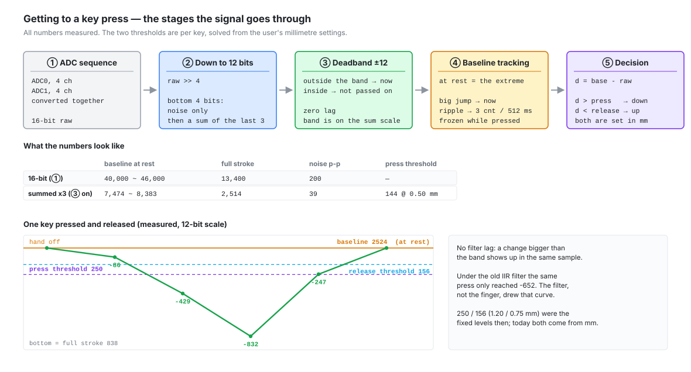

`wish-he` is custom firmware for commercial Hall-effect keyboards, running on an
HPM5361 (RISC-V, 400 MHz). An ADC scan turns 64 magnets into 64 numbers and a curve
turns those into millimetres; this post is the layer above both. Given a depth, decide
pressed or released and hand QMK a row bitmask that looks like a normal switch matrix.
The comparison is one line. The work is in the filter in front of it, the reference it
compares against, and what happened to both once the thresholds were written in
millimetres.



## What I measured first

Pressing makes the value go *down* — the magnet gets closer. On the raw 16-bit scale the
full stroke was 13,400 counts, the spread of the resting value between cells was 5,800,
and peak-to-peak noise on an untouched key was 200. A stroke 2.3 times the cell spread is
the margin that lets a key held down during boot be spotted against the median.

Noise of 200 also means the bottom four bits carry nothing, so everything after the ADC
shifts right by 4, where the stroke is 838 and the noise ±6 counts.

## The filter: an IIR out, a deadband in

I started with a first-order IIR at 1/4. It did reduce the noise, and its settling time
went straight into the input latency: 63 % in 4 scans (152 us), 90 % in 9 scans (342 us).
So I replaced it with a deadband: a change larger than the band passes in the *same
sample*, and the ripple inside it never passes at all.

`firmware/wish-he/src/hw/driver/keys.c`
([permalink](https://github.com/chcbaram/wish-he/blob/2d5083019c522b35f0fe0d7c4f6d8df51b99d22f/firmware/wish-he/src/hw/driver/keys.c#L1710-L1728))

```c
static inline void keysFilter(uint32_t step, uint32_t ch, uint32_t packed)
{
  uint16_t v12 = (uint16_t)((packed & 0xFFFF) >> KEYS_RAW_SHIFT);
  int32_t  v;
  int32_t  o;

  /* slide the ring one place: drop the oldest sample, add the new one */
  v = (int32_t)acc_sum[step][ch] - (int32_t)acc_hist[step][ch][acc_idx] + (int32_t)v12;
  acc_hist[step][ch][acc_idx] = v12;
  acc_sum[step][ch]           = (uint16_t)v;

  /* the deadband is applied on the summed scale */
  o = (int32_t)raw[step][ch];

  if      (v > o + KEYS_DEADBAND) o = v - KEYS_DEADBAND;
  else if (v < o - KEYS_DEADBAND) o = v + KEYS_DEADBAND;

  raw[step][ch] = (uint16_t)o;
}
```

Both axes improved at once. Noise peak-to-peak went from 9–16 to 1–10, the lag from
152/342 us to 0 — and pressing at the same speed now reached a depth of -832 instead of
-652, against a stroke of 838. That last figure is the evidence: under the IIR I had only
ever seen 78 % of the stroke, and the smooth curve I admired in `keys map` was the shape
of the filter, not of my finger.

The latency budget for one key then read: one scan 38 us measured, filter **0**, report
wait at 8 kHz 0–125 us, total 40–165 us. The zero is the point of it. A later change
added a little back — summing the last three samples costs one sample of group delay,
28 us, and moved the deadband from 7 to 12 on the summed 0–12285 scale.

## The baseline is not a constant

Untouched is a *physical extreme*: the magnet is as far away as it gets, so the value is
as high as it gets. A running maximum therefore solves three problems at once — a key
held down during boot finds its reference the moment the finger lifts, temperature drift
is followed, and every cell gets its own value.

`firmware/wish-he/src/hw/driver/keys.c`
([permalink](https://github.com/chcbaram/wish-he/blob/2d5083019c522b35f0fe0d7c4f6d8df51b99d22f/firmware/wish-he/src/hw/driver/keys.c#L2562-L2576))

```c
    if (v > base[step][c])
    {
      if ((uint32_t)(v - base[step][c]) > KEYS_LATCH_JUMP)
      {
        base[step][c] = v;        /* a real release — take it now */
        latch_cnt++;
      }
      else if (do_drift)
      {
        base[step][c] += KEYS_DRIFT_STEP;   /* noise ripple — on the clock */
        drift_up_cnt++;
      }
    }

    d = (int32_t)base[step][c] - (int32_t)v;   /* depth: larger as it goes down */
```

The boot seed is 128 discarded scans and then 1024 averaged ones; the discarded ones
cover the settling of the ADC reference and the sensor bias. Three traps came out of the
tracker.

**The drift band missed by a hair.** Hand off the board, `keys map` printed -303 to -308
without stopping. A running-extreme reference sits on the noise by construction, so an
offset of about one noise amplitude is expected; the bug was the correction window.
`KEYS_DRIFT_BAND` was 300, so `d < KEYS_DRIFT_BAND` with `d` at 307 never once ran. Tying
the band to the release threshold instead of picking a number makes it mean "keep
correcting while the key is not pressed".

**The period was counted in scans.** `keys watch` showed the offset parked at -40 to -120
and never shrinking — not broken, frozen. It runs about 20 times a second, so one count
took 51 seconds; the main loop runs 26,000 times a second and takes 39 ms. Temperature
drift is physics, so it gets counted in milliseconds.

**Up and down used different clocks.** The reference fell on that timer but rose on every
noise peak, and peaks arrive at the scan rate. The main loop gives the upward path 1,300
times more chances than the CLI does, which pushes the equilibrium up. I made the upward
path symmetric before that produced a symptom: only a large jump, a real release, is
immediate.

## What honest labels exposed

A user's "0.30 mm" finally *was* 0.30 mm once the curve went underneath, and the same
millimetre became about 2.7 times fewer counts. That exposed several things.

**Shallow actuation points.** Against a measured noise floor of 40 counts peak-to-peak,
0.10 mm is 26 counts — a threshold below the noise. 0.30 mm is 82 and 0.50 mm is 144.
Nothing got worse: the old "0.30 mm" was really 0.72 mm at 222 counts, and still is. What
changed is that the user's number is now the one they get, and the top of the travel is
where the magnet is furthest and the signal weakest. So there is a
floor, taken from the noise: 60 counts, 1.5 times peak-to-peak, about 0.22 mm. A ratio
rule ("never below 1/10 of full scale") would be wrong on a scale this fine — 1/10 of
2,514 counts is 0.80 mm. The floor is applied where counts are computed, not in the
configurator: settings arrive over the VIA channel, a per-key command and the CLI, so a
UI check leaks.

**Noise has to be read in millimetres too.** I chased "it shows 0.1 mm with nothing
touching it" while measuring only in counts. The curve is flat at the top, so the same
count deviation is inflated about sixfold there: 22 counts peak-to-peak is small, and on
screen it is 0.10 mm. Repeating a 3-second window is also not the same as watching one
long one — rare events scatter and never become anyone's worst case. Sixty seconds,
1.75 million scans: most cells 0.02–0.06 mm, worst cell 0.10 mm.

**The deadzone and the display squelch are different jobs.** I once stopped the screen
twitching by raising the deadzone, then backed it out. The deadzone is the region ignored
when deciding a press, so 0 is a valid answer; the squelch keeps the displayed number
still, so it comes from the noise floor. Tied together, a deadzone of 0 made the screen
twitch again — which makes 0 look unusable, which makes you raise the default. A setting
must not be dragged around by what the screen needs.

`firmware/wish-he/src/hw/driver/keys.c`
([permalink](https://github.com/chcbaram/wish-he/blob/2d5083019c522b35f0fe0d7c4f6d8df51b99d22f/firmware/wish-he/src/hw/driver/keys.c#L2641-L2652))

```c
    {
      uint16_t sq = squelch_cnt[idx];

      if (d >= (int32_t)sq)          squelch[step] &= (uint16_t)~bit;
      else if (d <= (int32_t)(sq / 4)) squelch[step] |= bit;
    }

    if (d < (int32_t)t->dead || d < 0)
    {
      d = 0;
      rt_arm[step] &= (uint16_t)~bit;
    }
```

The squelch is a constant, 0.12 mm, just above that 0.10 mm worst cell. It wakes at the
threshold and goes quiet again only at a quarter of it, because one threshold for both
edges makes the value flicker at the boundary. It also has to be read *before* the
deadzone branch zeroes `d`, or every scan reads as idle. I wrote it the other way first.

**The deadzone is a floor, not an addition.** With actuation at 1.00 mm a deadzone of
0.20 mm does nothing, and one of 1.50 mm overwrites the actuation point while the screen
still shows the old number. Additive would turn the actuation point into a lie, so the
ordering `0 <= deadzone <= release < actuation` is enforced where the thresholds are
built. And when it clips it says so: `keys rt` prints
`0.40 mm (23 counts)  <- clipped at the release point`.

<!-- PHOTO: a key held part-way down, with the configurator's live depth readout beside it -->

## The trap the curve created

The tracker stepped the reference down only for cells inside the noise band, which was
safe while the band sat far below any threshold. The curve broke that quietly: 0.50 mm is
145 counts and the band is 150, so a key held shallow sat inside it and the reference
walked down to meet it. Measured with `keys inject` at 0.30 mm, the depth fell
from 116 to 14 and the key released itself after about 18 seconds with the finger still
on it.

`firmware/wish-he/src/hw/driver/keys.c`
([permalink](https://github.com/chcbaram/wish-he/blob/2d5083019c522b35f0fe0d7c4f6d8df51b99d22f/firmware/wish-he/src/hw/driver/keys.c#L2597-L2602))

```c
    if (do_drift && d > KEYS_DRIFT_STEP && d < KEYS_DRIFT_BAND
        && (pressed[step] & bit) == 0)
    {
      base[step][c] -= KEYS_DRIFT_STEP;
      drift_dn_cnt++;
    }
```

The fix filters on the decision instead of on the depth. The reference means "the value
when the key is not pressed", so it has no reason to move while the key is pressed — and
that holds wherever the thresholds sit.

## Checking it

`keys noise` over 37,148 scans in 3 seconds gave amplitudes of 1–10, mostly 4–7, with the
centre between -2 and +2 on every cell. A centre that close to zero means the tracking
converges; an amplitude above zero means the filter has not killed the signal.

## Still open

- TODO(author): the notes say the boot seed takes about 52 ms, but 1152 scans at 38 us is
  about 44 ms. Which one is right?
- TODO(author): the `keys noise` figures above were measured on the 12-bit scale, before
  the 3-sample sum and the deadband change from 7 to 12. Has that been re-run since?

## Links

- [Turning Counts Into Millimetres](../flux-to-distance-curve/) — where the distance
  comes from
- [A Ghost Input Above the Actuation Point, and the Two Bugs Under It](../wish-he-rapid-trigger/) —
  what sits on top of this decision
- [wish-he](https://github.com/chcbaram/wish-he)
- [Firmware development notes](https://github.com/chcbaram/wish-he/tree/2d5083019c522b35f0fe0d7c4f6d8df51b99d22f/firmware/wish-he/docs) (Korean)

<!--
sources (commit 2d5083019c522b35f0fe0d7c4f6d8df51b99d22f):
- firmware/wish-he/docs/06-key-decision.md — 먼저 잰 것(방향, 13,400 / 5,800 / 200,
  12비트 838 / ±6), 12비트로 내린다, IIR -> 데드밴드(152/342us, 9~16 -> 1~10,
  -652 vs -832, 78%), 지연 예산 표(38us, 0, 0~125us, 40~165us), 기준값은 고정값이
  아니다(러닝 최대, 부팅 씨앗 128+1024, 중앙값 이상치), 함정 ①②③(300 vs 307,
  20회/초 51초 vs 26000회/초 39ms, 32ms 하강 vs 스캔 기준 상승 1300배),
  검증(keys noise 37,148회 3초, 진폭 1~10, 중심 ±2; keys base 2493/2522/2526 vs
  2643~2876, 최소 간격 13%), 남은 것(64셀 매핑, ch0~2 잡음)
- firmware/wish-he/docs/15-distance-curve.md — 얕은 입력지점(0.10/0.30/0.50mm ->
  26/82/144 카운트, 옛 0.30 은 실제 0.72mm 222 카운트, 하한 60 카운트 ≈ 0.22mm,
  비율 규칙을 안 쓰는 이유 254 vs 2514, 화면이 아니라 환산 지점에서 막는다),
  잡음도 mm 로(22 카운트 = 0.10mm, 6배 부풀림, 60초 175만 회 -> 0.02~0.06mm / 최악
  0.10mm, LED 41~42 로 무관), 데드존과 표시 스퀄치는 다른 일이다, 데드존은 더하기가
  아니라 밑바닥이다(1.00/0.20, 1.00/1.50, 순서 규칙, keys rt 의 잘림 표시)
- firmware/wish-he/docs/13-rapid-trigger.md — 단일 표본 p-p 17 / 누적 3개 p-p 39,
  눈금 0~12285, 데드밴드 7 -> 12
- firmware/wish-he/docs/05-adc-scan.md — 누적 눈금 실측(안 눌림 7474~8383, 스트로크
  2514, 61키 평균)
- firmware/wish-he/src/hw/driver/keys.c — L170 KEYS_ACC_CNT(이동합 군지연 1샘플 28us),
  L184-185 부팅 씨앗(38us 기준 약 44ms), L265-266 KEYS_PRESS_LEVEL/RELEASE_LEVEL
  (750 ≈ 1.20mm, 468 ≈ 0.75mm, 이제 판정에 안 쓰인다), L286-287 드리프트 밴드·주기,
  L298 DRIFT_STEP, L305 LATCH_JUMP, L322 RAW_SHIFT, L362 DEADBAND 12,
  L991 KEYS_RT_MIN_CNT 60, L1039 KEYS_SQUELCH_UM 12, L1710-1728 keysFilter,
  L2428 입력지점 하한, L2503 데드존 상한, L2562-2576 기준값 상승, L2597-2602 드리프트
  하강(pressed 게이트, 0.30mm 에서 116 -> 14, 약 18초), L2641-2652 스퀄치와 데드존,
  L5212-5217 keys rt 의 잘림 표시
- 코드 발췌 네 블록은 원본과 한 줄씩 대조했다. 줄 수는 그대로다. 한국어 주석은 영어로
  옮겼고, L2562-2576 에서는 원본의 긴 주석 블록(L2545-2561)을 빼는 대신 같은 뜻의 짧은
  주석을 코드 줄 끝에 달았다.
- 그림: docs/images/keys-pipeline.svg 를 복사해 라벨만 영어로 옮겼다. 구조·좌표·색은
  그대로다. 코드와 달라 고친 곳 —
    ③ "데드밴드 ±7" -> "Deadband ±12" (KEYS_DEADBAND 는 12이고 눈금도 합 0~12285다)
    ③ "노이즈 p-p 12→5" -> "band is on the sum scale" (12→5 는 12비트 시절 값이다)
    ② 마지막 줄에 "then a sum of the last 3" 을 넣었다 — keysFilter 에 3개 이동합이
      들어왔는데 그림에 그 단계가 없었다
    ④ "잔파도 → 512ms당 1" -> "ripple → 3 cnt / 512 ms" (KEYS_DRIFT_STEP = 3)
    ④ "누른 채 부팅 복구" -> "frozen while pressed" — L2597-2602 의 pressed 게이트가
      새로 생겼고 그게 이 글의 마지막 함정이다
    ⑤ "d > 250 → 눌림 / d < 156 → 해제" -> "d > press / d < release, both set in mm".
      250·156 은 KEYS_PRESS_LEVEL/RELEASE_LEVEL 인데 L259-266 주석대로 이제 판정에
      쓰이지 않는다. 판정은 thr[] 이 하고 그 값은 mm 설정에서 나온다
    표 둘째 줄 "12비트 (② ~)" -> "summed x3 (③ on)" 로 바꾸고 값을 실측 누적 눈금으로
      갈았다 (7,474~8,383 / 2,514 / 39 / 0.50mm 에서 144). 16비트 줄의 "누름 임계
      4,000" 은 파생값이라 "—" 로 비웠다
    스트로크 그래프는 06편 실측 그대로 두고(12비트) 제목에 눈금을 적었다. 점선 두 개는
      "press threshold 250 / release threshold 156" 으로만 적고, 그것이 옛 고정값이며
      1.20 / 0.75mm 라는 사실은 옆 상자에 적었다
  xml.etree.ElementTree.parse() 통과. headless Chrome 으로 1180x636 렌더해 눈으로
  확인했다 (qlmanage 는 정사각 썸네일이라 오른쪽이 잘려 쓸 수 없었다).
-->
