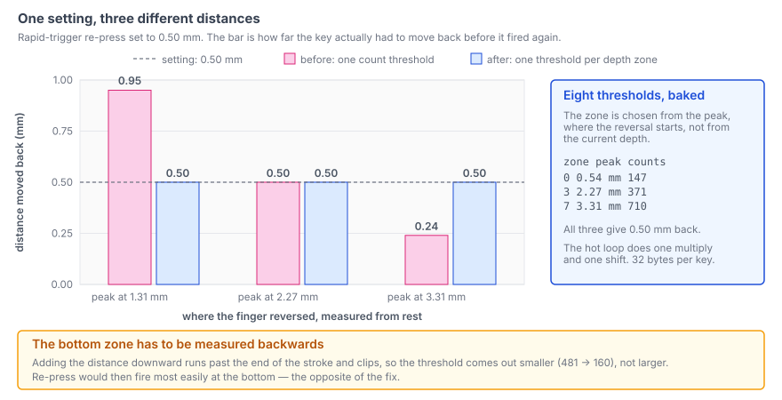

`wish-he` is custom firmware for commercial Hall-effect keyboards, running on an
HPM5361 (RISC-V, 400 MHz). A Hall-effect key reports depth instead of on/off, so
rapid trigger can judge it by **how far the direction reversed** rather than by a
fixed point on the stroke. This post is about the calls I got wrong while building
that layer and had to reverse. The main one: a re-press distance is a
*displacement*, and I had stored it as if it were a *position*. As long as counts
and millimetres were related by a straight line, nobody could tell. The moment
they were not, rapid trigger became twice as twitchy at the depth where fingers
actually live.

## Every setting is per key, and "global" is just select-all

Before this went in, the decision read global constants. The actuation-point
slider in the configurator was writing to EEPROM and never reaching the decision
at all. Both halves looked right on their own.

So the settings record grew. The per-key settings struct went from 8 to 24 bytes
and the stored record from 544 B to 1568 B, carrying per key: actuation point,
release point, rapid-trigger re-press, rapid-trigger release, bottom protection,
deadzone and the rapid-trigger flags.

`firmware/wish-he/src/hw/driver/keys.c`
([permalink](https://github.com/chcbaram/wish-he/blob/2d5083019c522b35f0fe0d7c4f6d8df51b99d22f/firmware/wish-he/src/hw/driver/keys.c#L697-L708))

```c
typedef struct
{
  uint16_t press_um;       /* actuation point       0.01 mm */
  uint16_t release_um;     /* release point         0.01 mm */
  uint16_t rt_press_um;    /* RT re-press           0.01 mm */
  uint16_t rt_release_um;  /* RT release            0.01 mm */
  uint16_t bottom_um;      /* bottom protection     0.01 mm */
  uint16_t dead_um;        /* deadzone              0.01 mm */

  uint8_t  sw_type;        /* index into the switch table */
  uint8_t  rt_flags;       /* KEYS_RT_* */
```

The rule I settled on is that the decision *always* reads the per-key value. On a
screen where you pick which keys to configure, "select all" already is the global
setting; keeping a second notion of global only creates a permanent question about
which one wins. The profile's global fields do two jobs and no others: defaults
for a new setting, and the value the configurator fans out across 64 keys when it
writes globally.

Settings arrive in 0.01 mm and the decision runs in counts. Converting needs the
per-key stroke, which is a division, and there is no division to spare in a loop
that covers 64 cells at 35 kHz. So a threshold table is baked and rebuilt only
when settings or calibration change.

<!-- PHOTO: the per-key tab in the configurator with a single key selected, showing all six distances -->

### The travel was 4.0 mm and the switch is 3.4 mm

The default full travel in the switch table was 4.0 mm. The switches in this board
travel 3.4 mm. Count-based decisions did not care, but every millimetre on screen
was 18 % out — "actuation point 1.00 mm" was really 0.85 mm.

The evidence had been on screen from the first day. Pressing a key to the bottom
read 3.385 mm. I read that as a 4.0 mm switch pressed to 3.385 mm. It was a 3.4 mm
switch pressed all the way. Two rounds of analysis went on top of that reading,
including a "the two scales agree within 4 %" conclusion I later had to delete.

The switch table is now two kinds of entry: a generic one for "I do not know what
this is, but the travel is roughly right", and product entries that use the
datasheet travel. The stroke in *counts* is in no datasheet — magnet strength and
sensor placement decide it — so it has to be measured on the board.

## Bottom protection and the deadzone are different objects

They read like the same idea, a band where the decision is suspended. They sit at
opposite ends of the stroke and solve unrelated problems.

| | where | what it does |
|---|---|---|
| deadzone | near rest, at the top | ignores accidental input from vibration and tolerance |
| bottom protection | near the bottom | turns the rapid-trigger release off |

Bottom protection exists because the rapid-trigger release fires on "how far back
up from the deepest point reached". Hold a key against the bottom and that
reference is pinned there, while the finger keeps relaxing by 0.1 to 0.3 mm as it
holds. The relaxation alone fires a release and the key stutters. In normal mode
the release point is an absolute position far from the bottom, so this never
happens — it is specific to rapid trigger. It is not a noise problem either:
0.1 mm is 63 counts and the noise sigma is about 7. The deadzone defaults to 0,
and users raise it only where there is real vibration.

## A re-press distance is a displacement, not a position

Then I replaced the linear count-to-millimetre mapping with the switch's actual
flux-versus-distance curve. That is its own post. What matters here is what it
broke.

Absolute positions — actuation, release, deadzone, bottom protection — just get
pushed through the curve and come out right. The two rapid-trigger values are not
positions. They are displacements, and on a curve the same millimetre is a
completely different number of counts depending on where the movement started. I
was holding each of them as one count per key, so each was correct at exactly one
depth.



Deep is where a finger sits while typing, which is why turning rapid trigger on
felt so much more nervous than the number I had typed in.

Converting on every sample is the honest fix and I cannot afford it at 64 cells
and 35 kHz. So the thresholds are baked instead. The top three bits of the
normalised depth give eight zones, and the rebuild computes a threshold per zone.
The scan loop does one multiply and one shift.

`firmware/wish-he/src/hw/driver/keys.c`
([permalink](https://github.com/chcbaram/wish-he/blob/2d5083019c522b35f0fe0d7c4f6d8df51b99d22f/firmware/wish-he/src/hw/driver/keys.c#L2515-L2521))

```c
ATTR_RAMFUNC static inline uint32_t keysRtZone(uint32_t idx, uint16_t cnt)
{
  uint32_t z = ((uint32_t)cnt * stroke_recip[idx])
               >> (KEYS_STROKE_RECIP_SH + 15 - KEYS_RT_ZONE_BITS);

  return (z >= KEYS_RT_ZONE_CNT) ? (KEYS_RT_ZONE_CNT - 1) : z;
}
```

That costs 32 bytes per key, 2 KB across the board, and the scan measured 28 us
with rapid trigger on — the same as without it.

Two things I got wrong inside the fix itself.

**The zone comes from the peak, not from the current depth.** The rollback is a
movement that begins at the reference point, so the threshold has to be measured
with the slope *there*.

**The bottom zone has to be measured backwards.** The re-press threshold is built
by adding the distance downward from the middle of the zone. For the deepest zone
that runs past the end of the stroke and clips, and a clipped threshold comes out
*smaller* — 481 counts down to 160 — so re-press would fire most easily at the
very bottom. That is the exact opposite of what the change is for.

`firmware/wish-he/src/hw/driver/keys.c`
([permalink](https://github.com/chcbaram/wish-he/blob/2d5083019c522b35f0fe0d7c4f6d8df51b99d22f/firmware/wish-he/src/hw/driver/keys.c#L2343-L2354))

```c
      dn = m0 + k->rt_press_um;
      if (dn > travel)
      {
        uint32_t lo = (travel > k->rt_press_um) ? (travel - k->rt_press_um) : 0;

        t->rt_press[z] = (uint16_t)(((KEYS_CURVE_ONE - Z_U(lo)) * stroke)
                                    / KEYS_CURVE_ONE);
      }
      else
      {
        t->rt_press[z] = (uint16_t)(((Z_U(dn) - u0) * stroke) / KEYS_CURVE_ONE);
      }
```

Measuring backwards from the bottom gives the slope of the last stretch, which is
the right answer to "how many counts is 0.30 mm *here*", and since the key cannot
travel that much further down, re-press never fires while it is held against the
bottom. That is the behaviour I want.

I only saw the clipping because `keys rt` prints all eight zones. One
representative value would have hidden it.


## Not fixing a problem that was not there

The drift correction walks each key's baseline one step every 512 ms. My notes
said I would have to spread that work out, because doing 64 keys in one scan makes
that one scan heavy and the period jitter.

I measured before touching it. Running drift on *every* scan gave `keysUpdate` =
28 us, the same as always. A handful of comparisons and increments across 64 cells
does not show up. The counters agreed from the other side: in 45 seconds there
were 30 scans over 60 us, while drift ran 88 times — the two do not line up.

The real problem was the step size. Accumulating three samples made the scale
three times larger while the step stayed at 1 count, so one step fell from 1/836
of the stroke to 1/2508 — three times slower against temperature drift, which has
not slowed down at all. Tying the step to the accumulation count puts the physical
speed back.

The same week I spent a while suspecting the structure over a `keyboard_task
max 308 us` reading. Counting the exceedances settled it in a minute: 3 out of
1.53 million passes, all during boot and CLI activity. A maximum does not
distinguish between three times and five thousand times.

## What the week taught me

Everything I got wrong here, I got wrong by moving before measuring.

| guess | measured |
|---|---|
| drift shakes the scan period | 28 us either way |
| `max 308 us` is a structural problem | 3 out of 1.53 million, at boot |
| full travel is 4.0 mm | 3.4 mm |
| a re-press distance is one number | one number per depth zone |

Choosing not to fix something is a result too, as long as the measurement came
first.

## Still open

- Tuning the re-press and release distances in real use. That is now the search
  for one number. Before the zone work it was not even a well-posed question,
  because the key behaved differently at every depth.
- Reading the switch table from the device. Firmware and web app each carry a copy
  today, so they can drift apart.
- Eight zones is a chosen number. I went through a few sizes and settled on the one
  that looked reasonable; there is no hardware comparison against four or sixteen in
  the repo, and I am not going to present a judgement call as a measurement.

## Links

- [wish-he](https://github.com/chcbaram/wish-he)
- [A Ghost Input Above the Actuation Point](../wish-he-rapid-trigger/) — two bugs
  that came out of exactly this decision layer
- [Deciding a Key Is Pressed](../deciding-a-key-is-pressed/) — the press decision
  underneath rapid trigger
- [Reading Magnet Depth With an ADC](../reading-magnet-depth-with-adc/) — where the
  counts, the accumulation and the noise floor come from
- [Firmware development notes](https://github.com/chcbaram/wish-he/tree/2d5083019c522b35f0fe0d7c4f6d8df51b99d22f/firmware/wish-he/docs) (Korean)

<!--
sources (commit 2d5083019c522b35f0fe0d7c4f6d8df51b99d22f):
- firmware/wish-he/docs/13-rapid-trigger.md
  - ③ 드리프트 — 없는 문제를 고치지 않는다 (28us, 45초에 60us 초과 30회 vs 드리프트
    88회, 걸음 1/836 -> 1/2508, max 308us 는 153만 중 3회)
  - 바닥 보호와 데드존은 다른 물건이다 (0.1~0.3mm 이완, 0.1mm = 63카운트, σ 약 7)
  - 설정을 전부 키별로 (8B -> 24B, 544B -> 1568B, 키별이 기본이고 전역은 "모두 선택",
    슬라이더가 판정에 안 닿던 것) + 전 행정 4.0mm 가 틀렸다 (3.4mm, 18%, 3.385mm)
  - 뒤에 고친 것 — 이동량은 위치가 아니다 (구역 여덟, peak 기준, 바닥 481 -> 160)
  - 배운 것 / 남은 것
- firmware/wish-he/docs/15-distance-curve.md — ★ 이동량은 위치가 아니다
  (깊이 1.31/2.27/3.31mm 에서 실제 되돌림 0.95/0.50/0.24mm, 구역 0/3/7 문턱 147/371/710)
- firmware/wish-he/src/hw/driver/keys.c — L697-708 keys_key_set_t,
  L2343-2354 바닥 구역 되눌림, L2515-2521 keysRtZone, L929-943 구역 상수와 keys_thr_t,
  L2290-2380 keysThrRebuild
- commits: c7ffb88 (③ 드리프트), 752e1ca (④ RT·바닥 보호·데드존), 2e0734c (cfg v4
  키별 설정), bed5f27 (스위치 표를 일반형/제품으로, 3.4mm), 333f331 (RT 를 깊이
  구역마다 재단, 28us 유지, 키당 32B)
- 2,514 카운트: bed5f27 커밋 본문의 "61키 보정 평균 2514"
- 코드 발췌의 한국어 주석은 영어로 옮기거나 지웠다. 코드 줄은 원본 그대로다.
  L697-708 은 구조체 앞부분만 잘라 왔다 (뒤의 rsv[10] 와 크기 주석은 뺐다).
- rt-displacement.svg — 직접 그렸다. 저장소의
  docs/issues/images/002-rt-window.svg 는 RT 유효 구간(이슈 #2 원인 B) 그림이라
  이미 발행한 wish-he-rapid-trigger 글의 몫이어서 쓰지 않았다. 막대 값은
  15-distance-curve.md 의 두 표에서 그대로 가져왔고, 없는 점은 찍지 않았다
  (깊이 세 곳만). 스타일은 reading-magnet-depth-with-adc/noise-correlation.svg 를
  따랐다.
-->
