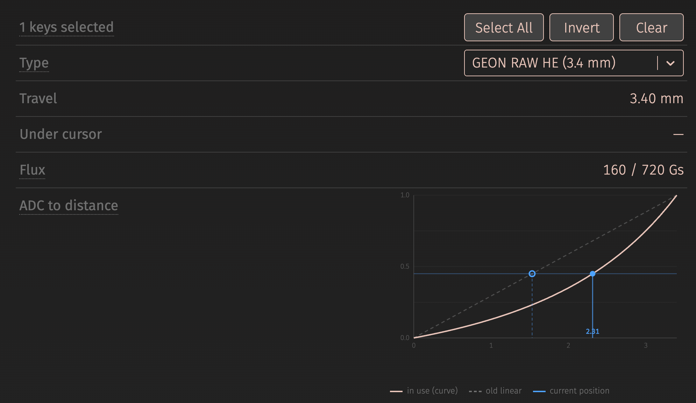

`wish-he` 는 시판 홀이펙트 키보드에 올리는 커스텀 펌웨어다. HPM5361(RISC-V, 400 MHz)
에서 돈다. [앞 글](../reading-magnet-depth-with-adc/)은 숫자를 얻는 데까지 갔다. 스캔할
때마다 64칸이 각각 누적 ADC 카운트가 되고, 키별 기준값과 견준다. 키가 눌렸다는 걸 알기에는
그걸로 충분하다. 슬라이더에 "1.00 mm" 라고 써 놓고 그 말을 지키기에는 부족하다.

나는 그 차이가 거리에 비례해 움직인다고 보고 있었다. 아니었다. 1.00 mm 로 친 입력지점이
1.78 mm 에서 걸리고 있었다. 그런데 어려울 줄 알았던 부분 — 스위치를 재는 일 — 은 아예
필요가 없었다.

## 직선은 하필 제일 중요한 자리에서 틀린다

행정의 두 점을 알고 있었다. 쉬는 자리의 값과 바닥에서의 값. 그 둘을 직선으로 이었다.
그런데 자석의 자기장은 손가락이 움직이는 것보다 훨씬 빠르게 약해진다. 관계가 휘고, 가장
크게 어긋나는 자리가 **한가운데** 다. 사람들이 입력지점을 두는 바로 그 자리다.


휘는 정도는 자속(magnetic flux, 자기장의 세기) 두 값의 비가 정한다. 내 보드의 GEON
RAW HE 는 3.40 mm 에 걸쳐 160 Gs 에서 720 Gs, 비가 4.50 이고 최대 0.80 mm 어긋난다.
Gateron KS-20 은 비가 8.87 이라 1.37 mm 다.

## 두 점, 미지수 둘

곡선을 얻는 뻔한 방법은 재는 것이다. 키캡 밑에 심(shim, 두께를 아는 얇은 판) 을 깔고
63번 반복한다. 그럴 필요가 없었다. 축 방향으로 자화된 원통 자석의 축상 자기장은 이미
알려진 식이다.

```
B(z) = (Br/2) * [ (z+L)/sqrt((z+L)^2 + R^2) - z/sqrt(z^2 + R^2) ]
```

미지수는 둘이다. 바닥에서의 유효 간격 `z0` 와 잔류자속밀도 `Br`(자석 자체의 세기).
그리고 제조사가 공개하는 것이 정확히 두 점이다 — 쉬는 자리의 자속, 바닥에서의 자속,
그 사이의 전 행정. 두 값의 **비** 를 잡으면 `Br` 이 약분돼 사라지고, `z0` 하나만 찾는
1차원 문제가 남는다.

이름을 붙여 둘 만한 실수 하나. `z0` 를 그럴듯한 값으로 고정해 놓고 `Br` 만 맞추는
것이다. 처음에 그렇게 했다. 한 점은 맞고 다른 점은 30 % 넘게 빗나간다.


하드웨어 사실도 하나 딸려 나온다. 맞춰 낸 `z0` 가 2.6~2.8 mm 라는 건 홀 센서가 PCB
**아랫면** 에 있다는 뜻이다. 요즘 스펙이 자속 옆에 PCB 두께를 같이 적는 이유다. 자석
형상을 어떻게 가정하는지는 거의 영향이 없다. Ø4 × 2.0 mm 와 Ø4 × 2.5 mm 가 행정
가운데에서 0.1 %, 거리로 2 µm 차이다.

## 정규화하면 개체차가 사라진다

스위치 공차가 ±12 % 까지 간다. 공칭값으로 만든 표에는 치명적으로 들린다. 읽은 값을
정규화하고 나면 아니다.

```
u = (adc - adc_rest) / (adc_bottom - adc_rest)
```

ADC 값이 자속의 아핀 함수 — `adc = a + b·B`, 즉 상수배에 상수를 더한 꼴 — 이기만 하면
`u` 는 `a` 와 `b` 에 전혀 흔들리지 않는다. 자석 세기는 `b` 로, 센서의 정지 오프셋은
`a` 로 들어간다. 모델에 대고 계산하면 `Br` 이 ±12 % 흔들려도 `u` 는 0.0000 % 움직이고,
오프셋을 아무렇게나 줘도 마찬가지다. 남는 것은 자리 높이다. ±0.2 mm 면 26 µm 다.

그래서 스위치 **종류마다** 표 하나면 63키가 다 쓴다. 키마다 필요한 값 둘은 내가 이미
들고 있는 것이다. 실시간으로 도는 기준값과 보정으로 얻은 전 행정.

## 표는 읽은 값이 아니라 거리로 나눈다

표는 `u` 를 담고 있고 **거리로** 찾아 들어간다. 반대로 하고 싶어지는데 그게 틀렸다.
`u` 를 균등하게 나누면 곡선이 가파른 쪽에서 해상도가 무너진다. `u` 의 첫 1/16 이 행정
0.64 mm 를 통째로 삼킨다.


33칸, Q15(정수 1비트·소수 15비트 고정소수), 거리 균일 간격. 데이터시트에서 나오는
것이라 EEPROM 에 들고 있을 이유가 없다.

`firmware/wish-he/src/hw/driver/keys.c`
([퍼머링크](https://github.com/chcbaram/wish-he/blob/2d5083019c522b35f0fe0d7c4f6d8df51b99d22f/firmware/wish-he/src/hw/driver/keys.c#L414-L423))

```c
/* 160 -> 720 Gs, 3.4mm. 직선으로 읽으면 최대 0.80mm 어긋난다 */
static const uint16_t curve_geon_raw_he[KEYS_CURVE_N] =
{
      0,   362,   743,  1144,  1565,  2010,  2478,  2973,
   3494,  4045,  4628,  5244,  5896,  6586,  7318,  8094,
   8918,  9793, 10724, 11713, 12767, 13890, 15087, 16365,
  17730, 19188, 20748, 22419, 24208, 26126, 28184, 30393,
  32767,
};
```

내가 모르는 스위치에는 곡선을 주지 않는다. 자속 값이 0 인 커스텀 칸에 들어가고, 직선으로
읽히고, 도구가 그렇다고 알려 준다.

## 곡선이 맞다가 아니라, 틀리는 양을 맞혔다

펌웨어부터 고쳤으면 모든 키의 느낌이 한꺼번에 바뀌는데 확인할 방법이 없다. 그래서 화면을
먼저 만들었다. VIA HE 의 스위치 화면이 두 선을 같이 그리고 그 사이에 실시간 점을 찍는다.



그다음에 캘리퍼로 잰 심을 키캡 밑에 쌓고 바닥까지 눌렀다. 1, 2, 3 mm 를 넣으면 화면의
깊이가 매번 1.00 mm 씩 움직였다. 반응이 직선이었다면 0.6~0.7 mm 씩 움직였을 것이다.

값어치가 있는 건 두 번째 시험이다. 키를 자속 값이 없는 항목으로 바꿔서 직선으로 읽히게
해 놓고, 실제로 2.00 mm 를 눌렀다.

```
읽힌 값        1.25 mm
곡선 모델 예측  1.23 mm     <- 0.02 mm 차이
직선이라면     2.06 mm     <- 0.81 mm 차이
```

"곡선이 맞다" 는 약한 주장이다. "직선이 얼마나 틀리는지를 0.02 mm 안으로 맞힌다" 가 훨씬
세다. 모델이 끝점 둘만 아는 게 아니라 **모양** 을 안다는 뜻이기 때문이다.

함정 하나. 키캡이 플레이트에 닿기까지 0.4 mm 쯤 여유가 있다. 절대값을 한 번 재면 그걸
빼야 하는데, 심 두 개의 차이를 보면 저절로 지워진다.

## 뜨거운 자리는 뜻밖에 RGB 였다

표를 거꾸로 타는 것 — 읽은 값에서 밀리미터로 가는 것 — 은 이분법 탐색이 든다. 그 경로는
화면에만 쓰이니 놀고 있을 거라고 생각했다. RGB 효과가 매 프레임 65키에 깊이를 묻고
있었다.

| 빌드 | 스캔 | RGB 태스크 평균 | 125 us 넘은 프레임 |
|---|---|---|---|
| 직선 | 28 us | 21 us | 590 |
| 곡선 첫 판 | 28 us | 34 us | 1177 |
| 32비트 연산 | 28 us | 29 us | |
| 역수 표 | 28 us | 26 us | |
| RGB 가 거리를 안 묻게 | 28 us | 25 us | 0 |

스캔은 내내 28 us 다. 키 판정은 카운트로 견주기 때문에 곡선을 아예 안 탄다.

첫 판의 64비트 나눗셈이 눈에 띄는 비용이었다. RV32 에서 그건 소프트웨어 루틴이다.
그다음에는 나눗셈을 통째로 없앴다. 부팅 때 표 구간의 역수를, 문턱을 다시 만들 때 키별
전 행정의 역수를 미리 구해 두면 곱셈 하나와 시프트 하나만 남는다. 이 역수들은 **계산해서**
만든다. 손으로 적은 상수였다면 곡선이 바뀌는 순간 어긋난다.

제일 크게 이긴 건 질문이 틀렸다는 걸 알아챈 것이다. 효과가 원하는 건 비율뿐인데, 곡선을
태워 밀리미터를 만든 다음 전 행정으로 나눠서 다시 0~255 로 돌아오고 있었다.

`firmware/wish-he/src/hw/driver/keys.c`
([퍼머링크](https://github.com/chcbaram/wish-he/blob/2d5083019c522b35f0fe0d7c4f6d8df51b99d22f/firmware/wish-he/src/hw/driver/keys.c#L4440-L4457))

```c
/* 얼마나 내려왔나, 0..255. 거리가 아니다.
   RGB 는 밀리미터가 필요 없으니 센서 비율을 그대로 준다 —
   곱셈 둘과 시프트 둘, 탐색 없음. */
uint8_t keysGetLevel8(uint16_t row, uint16_t col)
{
  uint32_t i = row * KEYS_CH_MAX + col;
  int32_t  d;
  uint32_t v;

  if (i >= KEYS_MAX)          return 0;
  if (is_calibrated == false) return 0;

  d = (int32_t)base[row][col] - (int32_t)raw[row][col];
  if (d <= 0) return 0;

  v = ((uint32_t)d * stroke_recip[i]) >> KEYS_STROKE_RECIP_SH;   /* 0 ~ 32767 */
  v = (v * 255U) >> 15;

  return (v > 255) ? 255 : (uint8_t)v;
}
```

예산을 넘긴 프레임이 0 이 됐다. 곡선을 넣기 전보다도 낫다. 문제는 평균이 아니라 꼬리였다.
탐색 안의 예측 안 되는 분기가 가끔 한 프레임을 늘리고 있었다.

## 장치가 자기 곡선을 만든다, 정수로

여기까지는 표를 `tools/he_magnet_fit.py` 로 오프라인에서 만들어 상수로 붙여 넣었다.
사용자 정의 스위치 칸을 만들려니 부팅 때 장치가 직접 풀어야 했다. 호스트는 여전히 두 점만
올려 보낸다. 완성된 표까지 올려 보는 것도 해 봤는데 버렸다. 둘 다 보내면 진실의 출처가
둘이 되고 조용히 갈라진다.

부동소수를 안 쓴다. 칩에 없어서가 아니다 — HPM5300 은 배정밀도까지 된다. 빌드가
`-march=rv32imac` / `-mabi=ilp32` 라서, 하드 float ABI 로 가려면 SDK 와 newlib 를 다시
구워야 한다. 부팅 때 한 번 도는 계산에 그럴 이유가 없다. 그래서 고정소수 길이, Q24 모양
함수, 64비트 정수 뉴턴 제곱근, 그리고 교차곱한 잔차의 부호로 하는 이분법을 쓴다.

`firmware/wish-he/src/hw/driver/keys.c`
([퍼머링크](https://github.com/chcbaram/wish-he/blob/2d5083019c522b35f0fe0d7c4f6d8df51b99d22f/firmware/wish-he/src/hw/driver/keys.c#L1985-L2003))

```c
  /*
   * 잔차 g(z) = f(z)*rest - f(z+T)*bot 의 부호를 본다.
   *
   * 나눗셈 없이 교차곱으로 두는 것이 요점이다 — 비를 직접 만들면 정밀도를 잃는다.
   */
  #define RESID(z)  ((int64_t)keysShapeQ20(z) * (int64_t)rest_gs                \
                   - (int64_t)keysShapeQ20((z) + t_um) * (int64_t)bot_gs)

  if ((RESID(lo) < 0) == (RESID(hi) < 0)) return false;

  for (uint32_t i = 0; i < 24; i++)
  {
    int32_t mid = lo + (hi - lo) / 2;

    if (mid == lo) break;
    if ((RESID(lo) < 0) == (RESID(mid) < 0)) lo = mid;
    else                                     hi = mid;
  }
  z0 = lo;
```

여기서 두 번 넘어졌다.

**단위가 섞였다.** 이 파일에서 `um` 이라고 부르는 건 사실 0.01 mm 다. 340 이 3.40 mm 다.
그런데 자석 치수는 진짜 마이크로미터로 적었다. 2.0 mm 를 2000 으로. 둘을 더하니 3.40 mm 가
0.34 mm 가 됐고, 비가 모델이 만들 수 있는 범위 밖으로 나가서 이분법이 근을 못 찾았다.
살짝 틀린 곡선이 아니라 곡선이 통째로 안 나왔다.

**정수 제곱근의 절사가 55배로 증폭됐다.** 모양 함수는 거의 같은 두 값의 차인데 둘 다
0.9 근처다. 그래서 `isqrt` 가 내림하면서 생긴 1e-4 의 상대 오차가 곡선에서는 0.47 % 로
나왔다. 고친 방법은 제곱근에 소수 8비트를 두는 것이다. `sqrt(v << 16) = sqrt(v) << 8` 을
쓴다.

| 소수 비트 | 모양 함수 최악 오차 | 곡선 최악 차이 |
|---|---|---|
| 0 | 1.77 % | 154 / 32767 |
| **8** | **0.007 %** | **17 / 32767** |
| 16 | 0.001 % | 17 / 32767 |

8비트를 넘기면 Q24 모양 함수 쪽이 한계다.

두 버그 다 같은 방법으로 잡았다. `keys sw` 가 장치가 방금 만든 33칸을 찍고, 그걸 앱의
부동소수 `heMakeCurve` 와 비교하면 어느 쪽이 틀렸는지 나온다. 최종 일치는 17 / 32767,
거리로 1.76 µm 다. 화면의 잡음 바닥이 100 µm 쯤인 것에 대면 충분하다.

그런데 이 숫자는 보이는 것만큼 값어치가 있지는 않다. `heMakeCurve` 는 같은 솔버를 옮긴
것이다. 그러니 이 비교가 증명하는 건 **고정소수 연산이 부동소수 연산에서 벗어나지
않았다** 는 것뿐이다. 모델이 맞다는 독립적인 확인이 아니다. 그걸 하는 건 위의 심 측정이다.
내 코드가 아니라 캘리퍼에 대고 견주기 때문이다.

## 배운 것

**화면을 펌웨어보다 먼저 만든다.** 두 선을 같이 보여 주는 화면이 없으면, 손에 심을 들고
있어도 견줄 대상이 없다.

**결과를 확인하는 것보다 오차의 크기를 예측하는 것이 세다.** 모델을 꺼 놓고 **틀린** 답을
맞히면 모양을 검사하는 것이 된다. 내가 맞춰 넣은 끝점 둘만 확인하는 게 아니라.

표에 있는 스위치 값은 전부 제조사 제품 페이지에서 가져왔다. 자속 두 값과 전 행정, 여기서
잰 것은 하나도 없다. 그게 요점이다. 이미 상점이 적어 두는 숫자로 충분하다면 지그가 필요한
사람은 없다.

33칸은 재서 나온 값이 아니라 고른 값이다. 몇 가지 크기를 놓고 해상도와 견주다가 적당해
보이는 데서 멈췄다. 17이나 65를 하드웨어에서 시도한 기록은 저장소에 없다. 판단으로 정한
것을 측정 결과인 양 적는 것보다는 이렇게 적는 게 낫다.

## 링크

- [wish-he](https://github.com/chcbaram/wish-he)
- [자석이 얼마나 내려왔는지를 ADC 로 읽기](../reading-magnet-depth-with-adc/)
- [키가 눌렸다고 정하기](../deciding-a-key-is-pressed/)
- [펌웨어 개발 노트](https://github.com/chcbaram/wish-he/tree/2d5083019c522b35f0fe0d7c4f6d8df51b99d22f/firmware/wish-he/docs)

<!--
sources (commit 2d5083019c522b35f0fe0d7c4f6d8df51b99d22f):
- 영어판 index.md 와 같은 출처. 번역이 아니라 한국어로 다시 썼다.
- 코드 발췌 주석은 저장소 원본 한국어다. 영어판은 그것을 번역해 실었다.
  keysGetLevel8 은 원본의 긴 머리말 주석을 3줄로 줄였고(영어판과 같은 범위),
  squelch 검사 한 줄은 뺐다 — 표시 스퀄치는 다른 글 몫이다.
- 용어: 바로 안 읽히는 말은 첫 등장에 괄호로 뜻을 붙인다 (자속, 잔류자속밀도 Br, 심,
  아핀 함수, Q15). 입력지점·해제지점은 음차하지 않는다.
- firmware/wish-he/docs/15-distance-curve.md 의 곡선 관련 절 전부 + ref/he-magnet-model.md
- flux-vs-distance.svg, two-point-fit.svg, lut-spacing.svg — 저장소에 없어 직접 그렸다.
  영어판과 같은 파일을 쓴다. 라벨은 영어다.
- via-curve-w880.png — 저자 제공 (via-he 영어 UI)
-->
