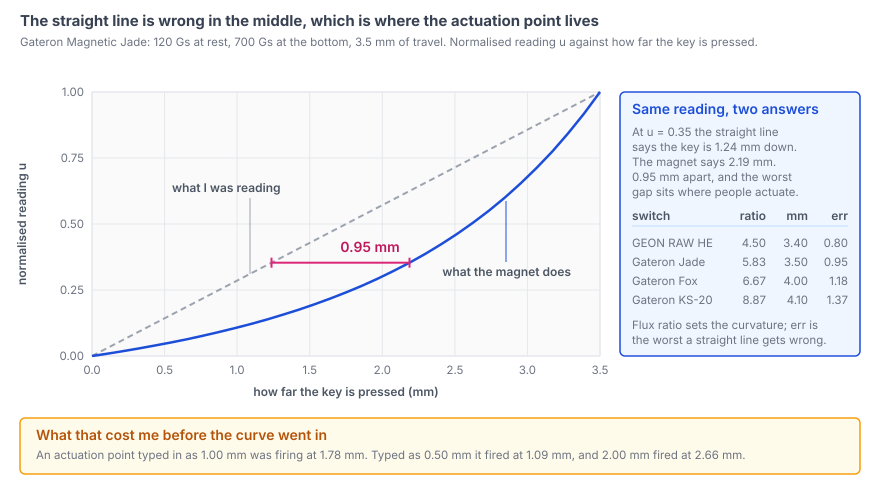
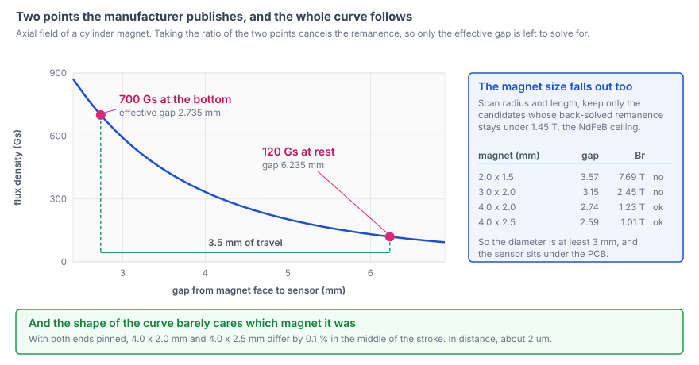
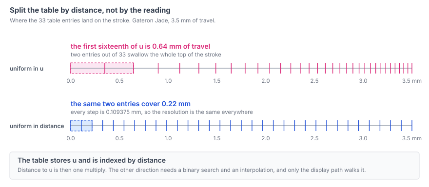

`wish-he` is custom firmware for commercial Hall-effect keyboards, running on an
HPM5361 (RISC-V, 400 MHz). The [previous post](../reading-magnet-depth-with-adc/)
got as far as a number: every scan turns each of the 64 cells into an accumulated
ADC count, judged against a per-key baseline. That is enough to know a key is
down. It is not enough to put "1.00 mm" on a slider and mean it.

I had been treating that difference as if it moved in a straight line with
distance. It does not: an actuation point typed in as 1.00 mm was firing at
1.78 mm. The part I expected to be hard — measuring the switch — was not needed.

## The straight line is wrong exactly where it matters

I knew two points of the stroke, the reading at rest and the reading at the
bottom, and drew a line between them. But a magnet's field falls away far faster
than the finger moves. The relation bends, and the worst disagreement sits in the
middle — where people put their actuation point.



Curvature is set by the ratio between the two flux figures. My board's GEON RAW HE
(160 Gs to 720 Gs over 3.40 mm, ratio 4.50) is off by up to 0.80 mm; a Gateron
KS-20, ratio 8.87, by 1.37 mm.

## Two points, two unknowns

The obvious way to get the curve is to measure it: shims under a keycap, 63 times
over. Not necessary. The axial field of an axially magnetised cylinder magnet is
known:

```
B(z) = (Br/2) * [ (z+L)/sqrt((z+L)^2 + R^2) - z/sqrt(z^2 + R^2) ]
```

Two unknowns — the effective gap `z0` at the bottom of the stroke and the
remanence `Br` — and the manufacturer publishes exactly two points: the flux at
rest, the flux at the bottom, and the travel between them. Taking the *ratio*
cancels `Br`, leaving a one-dimensional root find for `z0`.

The mistake worth naming: fixing `z0` at a plausible value and fitting only `Br`.
I did that first. It matches one point and misses the other by over 30 %.



A hardware fact falls out too: a fitted `z0` of 2.6 to 2.8 mm says the Hall sensor
sits on the *underside* of the PCB, which is why recent specs quote a PCB
thickness next to the flux. The geometry guess barely matters — Ø4 × 2.0 mm and
Ø4 × 2.5 mm differ by 0.1 % mid-stroke, about 2 µm.

## Normalising makes the unit-to-unit spread disappear

Switch tolerances run to ±12 %, which sounds fatal for a table built from nominal
figures. Not once the reading is normalised:

```
u = (adc - adc_rest) / (adc_bottom - adc_rest)
```

If the ADC reading is an affine function of flux — `adc = a + b·B` — then `u` is
invariant to both `a` and `b`. Magnet strength lands in `b`, the sensor's
quiescent offset in `a`. Against the model, a ±12 % swing in `Br` moves `u` by
0.0000 %, and so does an arbitrary offset. What survives is seat height: ±0.2 mm
of it costs 26 µm.

So one table per switch *type* serves all 63 keys, and the two per-key numbers
are ones I have: the live resting baseline and the calibrated stroke.

## Split the table by distance, not by the reading

The table stores `u` and is indexed by travel. The other way round is tempting and
wrong: split `u` evenly and resolution collapses where the curve is steep — the
first sixteenth of `u` swallows 0.64 mm of stroke.



33 entries, Q15, uniform steps of travel. It comes from the datasheet, so there
is no reason to keep it in EEPROM.

`firmware/wish-he/src/hw/driver/keys.c`
([permalink](https://github.com/chcbaram/wish-he/blob/2d5083019c522b35f0fe0d7c4f6d8df51b99d22f/firmware/wish-he/src/hw/driver/keys.c#L414-L423))

```c
/* 160 -> 720 Gs, 3.4 mm. Read as a straight line it is off by up to 0.80 mm */
static const uint16_t curve_geon_raw_he[KEYS_CURVE_N] =
{
      0,   362,   743,  1144,  1565,  2010,  2478,  2973,
   3494,  4045,  4628,  5244,  5896,  6586,  7318,  8094,
   8918,  9793, 10724, 11713, 12767, 13890, 15087, 16365,
  17730, 19188, 20748, 22419, 24208, 26126, 28184, 30393,
  32767,
};
```

A switch I know nothing about gets no curve: it goes in a custom slot with its
flux figures at zero, is read as a straight line, and the tool says so.

## The error was predicted, not just the curve

Changing the firmware first would have altered every key's feel at once with no
way to check it, so the display came first: VIA HE's switch screen draws both
lines with a live dot between them.

<!-- PHOTO: VIA HE switch screen with both lines drawn and the live dot between them — window crop, so name it something like via-curve-crop.png -->

Then I stacked calliper-measured shims under a keycap and pressed to the bottom.
With 1, 2 and 3 mm of shim the displayed depth stepped by 1.00 mm each time. Had
the response been linear the steps would have been 0.6 to 0.7 mm.

The second test is the one that counts. I switched the key to an entry with no
flux figures, so it read linear, and pressed a real 2.00 mm.

```
read back            1.25 mm
curve model predicts 1.23 mm     <- 0.02 mm out
if it were linear    2.06 mm     <- 0.81 mm out
```

"The curve is right" is a weak claim. "The model predicts how wrong the straight
line is, to 0.02 mm" is stronger: it says the model knows the *shape*, not just
the endpoints.

One trap: there is about 0.4 mm of clearance before the keycap reaches the plate.
A single absolute measurement has to subtract it; the difference between two shims
cancels it.

<!-- PHOTO: the shim test — calliper-measured shims stacked under a keycap on the board -->

## The hot spot was RGB, which I did not expect

Going backwards through the table — reading to millimetres — needs a binary
search. I assumed that path was idle because it only feeds the display. The RGB
effect was asking 65 keys for their depth every frame.

| build | scan | RGB task, mean | frames over 125 us |
|---|---|---|---|
| straight line | 28 us | 21 us | 590 |
| first curve version | 28 us | 34 us | 1177 |
| 32-bit arithmetic | 28 us | 29 us | |
| reciprocal table | 28 us | 26 us | |
| RGB stops asking for distance | 28 us | 25 us | 0 |

The scan is 28 us throughout: the key decision compares counts, so it never walks
the curve.

The 64-bit division in the first version was the obvious cost — on RV32 that is a
software routine. Then the divisions went entirely: reciprocals of the table
intervals at boot, reciprocals of the per-key strokes when thresholds are rebuilt,
leaving a multiply and a shift. They are *computed*, never hand-written constants,
which would drift from the curve the moment it changed.

The biggest win was noticing the question was wrong. The effect only wants a
fraction; it was burning the curve to get millimetres, then dividing by the stroke
to get back to 0–255.

`firmware/wish-he/src/hw/driver/keys.c`
([permalink](https://github.com/chcbaram/wish-he/blob/2d5083019c522b35f0fe0d7c4f6d8df51b99d22f/firmware/wish-he/src/hw/driver/keys.c#L4440-L4457))

```c
/* How far down, 0..255. NOT a distance.
   RGB does not need millimetres, so hand it the sensor ratio directly:
   two multiplies and two shifts, no search. */
uint8_t keysGetLevel8(uint16_t row, uint16_t col)
{
  uint32_t i = row * KEYS_CH_MAX + col;
  int32_t  d;
  uint32_t v;

  if (i >= KEYS_MAX)          return 0;
  if (is_calibrated == false) return 0;

  d = (int32_t)base[row][col] - (int32_t)raw[row][col];
  if (d <= 0) return 0;

  v = ((uint32_t)d * stroke_recip[i]) >> KEYS_STROKE_RECIP_SH;   /* 0 ~ 32767 */
  v = (v * 255U) >> 15;

  return (v > 255) ? 255 : (uint8_t)v;
}
```

Frames over budget went to zero — better than before the curve. The problem was
never the mean but the tail: an unpredictable branch in the search was stretching
the occasional frame.

## The device builds its own curve, in integers

Up to here the tables came from `tools/he_magnet_fit.py` offline and were pasted
in as constants. A user-defined switch slot meant solving one on the device at
boot. The host still uploads only the two points: I tried uploading the finished
table too and dropped it, because shipping both gives two sources of truth that
quietly diverge.

No floating point — not because the chip lacks it, HPM5300 supports double
precision, but because the build is `-march=rv32imac` / `-mabi=ilp32` and a
hard-float ABI means rebuilding the SDK and newlib for something that runs once.
So: fixed-point lengths, a Q24 shape function, a 64-bit integer Newton square
root, and a bisection on the sign of a cross-multiplied residual.

`firmware/wish-he/src/hw/driver/keys.c`
([permalink](https://github.com/chcbaram/wish-he/blob/2d5083019c522b35f0fe0d7c4f6d8df51b99d22f/firmware/wish-he/src/hw/driver/keys.c#L1985-L2003))

```c
  /* Residual g(z) = f(z)*rest - f(z+T)*bottom; only its sign is used.
     The point is the cross product: forming the ratio directly loses precision.
     int64 because f() is Q24 (1.6e7) and flux can be 2000 -> 3.3e10. */
  #define RESID(z)  ((int64_t)keysShapeQ20(z) * (int64_t)rest_gs                \
                   - (int64_t)keysShapeQ20((z) + t_um) * (int64_t)bot_gs)

  if ((RESID(lo) < 0) == (RESID(hi) < 0)) return false;

  for (uint32_t i = 0; i < 24; i++)
  {
    int32_t mid = lo + (hi - lo) / 2;

    if (mid == lo) break;
    if ((RESID(lo) < 0) == (RESID(mid) < 0)) lo = mid;
    else                                     hi = mid;
  }
  z0 = lo;
```

Two stumbles here.

**Mixed units.** What this file calls `um` is really 0.01 mm — 340 means 3.40 mm —
but I wrote the magnet dimensions in actual micrometres, 2000 for 2.0 mm. Added
together, 3.40 mm became 0.34 mm, the ratio fell outside anything the model can
produce, and the bisection found no root: no curve at all, not a slightly wrong
one.

**Truncation in the integer square root, amplified 55 times.** The shape function
is the difference of two nearly equal values, both near 0.9, so a 1e-4 relative
error from `isqrt` rounding down came out as 0.47 % on the curve. The fix is eight
fractional bits on the root, using `sqrt(v << 16) = sqrt(v) << 8`:

| fractional bits | worst shape error | worst curve difference |
|---|---|---|
| 0 | 1.77 % | 154 / 32767 |
| **8** | **0.007 %** | **17 / 32767** |
| 16 | 0.001 % | 17 / 32767 |

Past eight bits the Q24 shape function is the limit.

Both bugs were caught the same way: `keys sw` prints the 33 entries the device
just built, and diffing them against the app's floating-point `heMakeCurve` says
which side is wrong. Final agreement is 17 / 32767, or 1.76 µm — against a display
noise floor near 100 µm.

## What I took from it

**Build the display before the firmware.** Without a screen showing both lines,
a shim in hand has nothing to be compared against.

**Predicting the size of an error beats confirming a result.** Predicting the
*wrong* answer, with the model switched off, checks the shape — not just the two
endpoints I fitted to.

Every switch in that table came from the maker's own product page — the two flux
figures and the travel, nothing measured here. That is the whole point: if the
numbers a shop already prints are enough, nobody needs a rig.

TODO(author): why 33 entries? Were 17 or 65 tried, and what decided it?

TODO(author): is the app's `heMakeCurve` independent of this solver, or a port of
it? A diff proves less if they share an origin.

## Links

- [wish-he](https://github.com/chcbaram/wish-he)
- [Reading Magnet Depth With an ADC](../reading-magnet-depth-with-adc/)
- [Deciding a Key Is Pressed](../deciding-a-key-is-pressed/)
- [Firmware development notes](https://github.com/chcbaram/wish-he/tree/2d5083019c522b35f0fe0d7c4f6d8df51b99d22f/firmware/wish-he/docs) (Korean)

<!--
sources (commit 2d5083019c522b35f0fe0d7c4f6d8df51b99d22f):
- firmware/wish-he/docs/15-distance-curve.md — 1.78mm 에서 눌리던 것, 자석은 거리의
  세제곱으로 멀어진다, 재지 않고 계산으로 얻는다, 정규화로 개체차 소거, 거리 균일
  분할, 화면이 펌웨어보다 먼저, 심 검증(1/2/3mm, 2.00mm -> 1.25/1.23/2.06, 키캡
  여유 0.4mm), 뜨거운 자리는 RGB(표, 역수 표, "그 자리에 거리가 필요 없다"),
  곡선을 장치가 만든다(단위 혼동, isqrt 소수 비트 표, 앱과 1.76µm), 배운 것
- firmware/wish-he/docs/ref/he-magnet-model.md — B(z) 식, 2점 피팅과 Br 소거,
  z0 만 맞추면 30% 어긋남, 자석 크기 역산 표(1.45T 한계, z0 2.6~2.8mm, PCB 밑면),
  형상 가정 0.1%/2µm, 정규화 불변성 표(Br ±12% -> 0µm, 오프셋 -> 0µm, 안착 높이
  ±0.2mm -> 26µm), 선형 매핑 오차 0.95mm @ 2.13mm, u 균일 분할 첫 구간 0.64mm,
  he_curve_q15 33칸 표, 제조사 2점 제원 표
- firmware/wish-he/src/hw/driver/keys.c — L414-423 curve_geon_raw_he,
  L455-511 스위치 표(GEON RAW HE 160/720/3.40mm, GENERIC 제거와 커스텀 슬롯),
  L1809-1824 keysCurveToU, L1841-1872 역수 표(부팅 때 생성), L1875-1910 모델 주석
  (rv32imac/ilp32 소프트 float, 하드 float 로 안 가는 이유), L1932-1947 KEYS_SQRT_F,
  L1963-2031 keysCurveBuild(단위 혼동 주석 포함), L2170-2220 keysCurveToUm,
  L4425-4457 keysGetLevel8, L5550-5595 keys sw 출력
- 그림 셋은 내가 그렸다. 저장소에 이 주제의 SVG 가 없다. 수치 출처:
  flux-vs-distance.svg — he-magnet-model.md 의 he_curve_q15(Jade 33칸)와 0.95mm,
    스위치 표는 15-distance-curve.md 의 자속 비/행정/직선 오차 표, 아래 띠는
    15-distance-curve.md 의 문턱 표(0.50/1.00/2.00mm -> 1.09/1.78/2.66mm)
  two-point-fit.svg — B(z) 는 he-magnet-model.md 부록 A 의 피팅값(z0 2.735mm,
    Br 1.228T, Ø4.0x2.0)으로 같은 식을 그렸고 두 점(120/700 Gs)을 재현한다.
    표는 3.3절 자석 크기 역산 표
  lut-spacing.svg — he_curve_q15 를 역으로 읽어 u 균일 분할 자리를 계산했다.
    0.64mm 는 6.1절 값(u 0 -> 0.0625), 0.109375mm 는 6.2절 주석 값
- 코드 발췌 셋 다 주석은 한국어 원본을 영어로 옮겼다. 코드 줄은 원본과 대조해
  그대로다. keysGetLevel8 에서는 squelch 검사 한 줄을 뺐다 — 표시 스퀄치는 "눌렸다
  말았다를 정하기" 글 몫이라 여기서 설명할 자리가 없다
- 이 글에 안 쓴 것 (다른 글 몫): 데드존·표시 스퀄치·얕은 입력지점·잡음을 mm 로
  보기, "이동량은 위치가 아니다"(RT 구역 문턱), 눌림 판정 내부와 기준값 추적
-->
