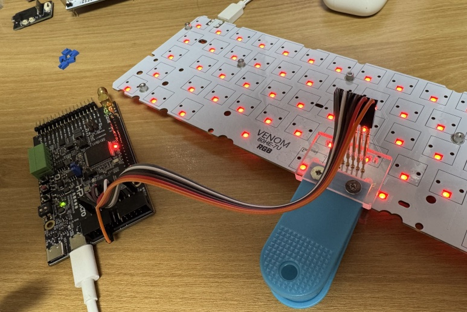
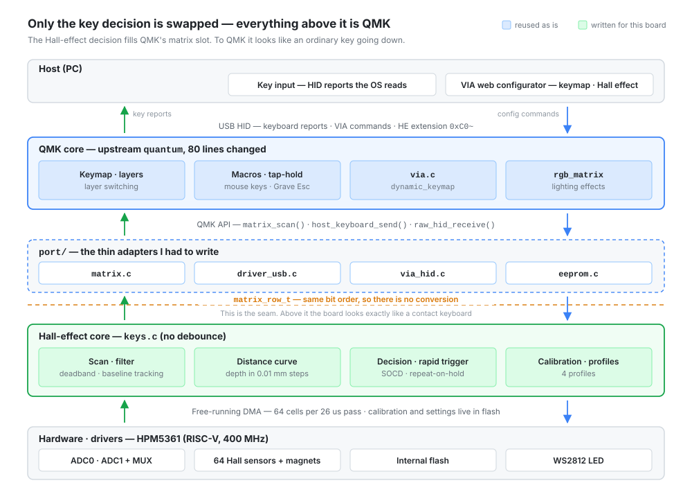
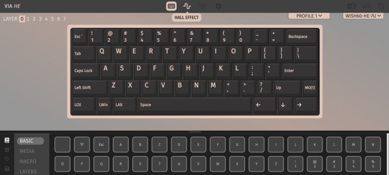

`wish-he` is custom firmware for commercial Hall-effect keyboards. It runs on an
HPM5361 (RISC-V, 400 MHz) and replaces the application image on boards I did not
design — the stock IAP bootloader stays where it is, so the board can always go
back. The interesting part is not the Hall-effect math. It is where I cut the
stack. Hall-effect firmware usually rewrites the key decision, and once you have
done that you find yourself rewriting layers, macros, tap-hold and a configurator
as well. I did not want to pay that. So I kept QMK and swapped out only the thing
underneath it: the part that decides whether a key is down.



## Why someone else's board

I meant to build the board myself. Two things moved that to later.

A PCB run is not cheap, and I would have been paying for one before knowing
whether my firmware worked. The second reason matters more. Bring up new firmware
on a board you also designed and every bug is two bugs until proven otherwise — is
this the hardware or the code? Starting on hardware that already works takes that
question off the table. When I do build my own board, the firmware will be a known
quantity, and anything that breaks is the board.

A commercial Hall-effect keyboard is also a good reference for a first Hall-effect
implementation. The switches, the sensor layout and the analog path are choices
somebody else already made and shipped.

## Where the cut is

A contact keyboard tells the firmware on/off. A Hall-effect switch tells it how
far the magnet has moved, in counts, on every scan. That extra information is the
whole point — rapid trigger needs it — but nothing above the decision layer cares.
Once a key is judged pressed, a keymap lookup is a keymap lookup.

So `keys.c` does the scan, the filtering and the press decision, and then hands
QMK a row bitmask. QMK never learns what kind of switch it is talking to.



The bitmask was built to match `matrix_row_t` bit for bit, back when there was no
QMK in the project at all, so the adapter does nothing but copy.

`firmware/wish-he/src/hw/driver/keys.c`
([permalink](https://github.com/chcbaram/wish-he/blob/2d5083019c522b35f0fe0d7c4f6d8df51b99d22f/firmware/wish-he/src/hw/driver/keys.c#L5028-L5036))

```c
/*
 * Hand out the row bitmask as is. The bit order matches QMK's matrix_row_t,
 * so the layers above do not have to know this board is Hall effect.
 */
uint16_t keysGetRow(uint16_t row)
{
  if (row >= KEYS_STEP_MAX) return 0;
  return pressed[row];
}
```

`firmware/wish-he/src/ap/modules/qmk/port/matrix.c`
([permalink](https://github.com/chcbaram/wish-he/blob/2d5083019c522b35f0fe0d7c4f6d8df51b99d22f/firmware/wish-he/src/ap/modules/qmk/port/matrix.c#L75-L83))

```c
  bool live = keysIsReportEnabled();

  for (uint8_t r = 0; r < MATRIX_ROWS; r++)
  {
    curr[r]  = live ? keysGetRow(r) : 0;   /* same bit order, taken as is */
    changed |= (matrix_row_t)(curr[r] ^ matrix[r]);
  }

  if (changed) memcpy(matrix, curr, sizeof(matrix));
```

`live` is false while a measurement command is running. Feeding QMK zeros makes it
decide on its own that everything was released and emit an empty report, so no key
is left stuck when I stop looking.

## What I would not hand to QMK

**Debounce.** QMK's matrix layer assumes metal contacts, so it holds a change for
a few milliseconds to ride out chatter — 5 ms by default. There is no contact in a
Hall-effect switch and therefore no bounce, so debounce has nothing to filter and
only adds delay. `port/matrix.c` never calls it. Noise is handled further down by
a deadband filter and by split press/release thresholds, and both of those cost
zero delay. Press is at 30 % of the stroke and release at 19 %; the gap between
them is the hysteresis.

That 30/19 split matters more than it looks. An earlier version of the filter was
a first-order IIR, and its settling time landed directly on input latency: 152 us
to 63 %, 342 us to 90 %. The deadband version reacts inside the same sample.

**Rapid trigger.** It watches for direction reversals on the order of 0.1 mm. If that ran on
the QMK loop it would be sampling a motion far finer than its own period. It runs
in `keys.c`, at the scan rate.

**Everything else** goes to QMK, and QMK is cheap there, because `action_exec`
only runs when a key changes. A fast typist produces a few hundred of those per
second, which has nothing to do with the 8 kHz polling rate.

## Two loops, one superloop

`firmware/wish-he/src/ap/ap.c`
([permalink](https://github.com/chcbaram/wish-he/blob/2d5083019c522b35f0fe0d7c4f6d8df51b99d22f/firmware/wish-he/src/ap/ap.c#L46-L58))

```c
void update(void const *arg)
{
#if defined(_USE_HW_LED)
  updateLED();
#endif

  keysUpdate();                       /* ADC scan + press decision */
  if (qmkIsOn()) qmkUpdate();         /* keymap, layers, macros, VIA -> HID */

  usbUpdate();                        /* boot/reset/tracking requests over HID */
  keysCfgUpdate();                    /* flush changed settings once it goes quiet */
  keysSwUpdate();                     /* same for changed switch definitions */
}
```

This is the honest version of the design. The two are conceptually independent,
but they are still one superloop, so a slower QMK still slows the scan. When I
first linked QMK in, the scan went from 38 us to 62 us for exactly that reason. I
wrote down that I would have to pull the scan out into an ADC-completion interrupt
before rapid trigger could work. Then I measured properly and the cause turned out
to be `-O0` and instruction-cache eviction, not the structure. With `-O2` and the
scan path placed in ILM it sits at 26 us per pass, about 38,000 passes per second,
and the separation stopped being urgent.

It is still a budget, not a guarantee. I am writing that down rather than claiming
the decoupling I have not built.


## VIA, not a VIA impersonation

The configurator is the part that usually decides these projects. Writing a
VIA-compatible protocol means reproducing what `via.c` does, and if I am going to
do that, I may as well compile `via.c`. It sits in the build with
`dynamic_keymap.c` behind it, and the keymap lives in a 16 KB emulated EEPROM.

QMK's EEPROM API is byte-granular and can be written at any time, which NOR flash
cannot do. So writes land in a RAM shadow and mark a sector dirty; a sector is
only burned after 200 ms of quiet, one sector at a time. Changing a keymap in VIA
sends hundreds of byte writes in a row, and burning each of them would erase the
same sector hundreds of times while interrupts are masked and USB stalls.

Our own Hall-effect commands were originally `0x01`/`0x02`/`0x03`, which collide
head-on with `id_get_protocol_version` and friends. They moved to `0xC0`–`0xCB`
before QMK landed, while I was still the only user of the tool. One exception is
deliberate: the bootloader jump kept VIA's own `0x0B`, so a stock VIA tool can put
the board into update mode.



## How much QMK did I actually touch

Less than "none", more than the diagram used to claim. The `quantum` tree is
vendored whole — 128 `.c` files — but only what is listed in CMake compiles, which
is around 19 of them plus the logging and send-string globs. Since the import
commit, the tree itself has taken 80 added and 5 removed lines across four files:
`eeconfig.c` (NKRO on by default via the eeconfig default, not `FORCE_NKRO`, so
the user can still toggle it), `dynamic_keymap.c` (per-profile keymap offsets, in
two passes, because VIA reads and writes keymaps through a buffer as well as
per key), `via.c`, and `keyboard.c` (suspend handling, which upstream does in a
protocol layer this port does not have).

Not everything is in. Key overrides and combos are not compiled in — nobody has
needed them yet, and they go in when somebody does. That does mean the "nothing is
missing" line in my README is an overstatement, and the README is what needs
fixing, not the build.

The `quantum` tree was upstream's latest when I did this work. The only marker the
port carries is `port/version.h` with `QMK_BUILDDATE "2024-04-23-11:29:54"`, so
that date is the practical reference point rather than a commit hash.

## What it costs

When QMK first went in, `keyboard_task` averaged 8 us. That was the number I had
written down as unknowable until measured, with a note that over 200 us would make
125 us polling pointless. It now averages 2 us across 311 million samples. The
worst single pass was 436 us, and exactly one pass has ever crossed 125 us — at
449 ms after boot, with nothing since across 2.7 hours of running. I would rather
report it that way than as a clean zero: the tail exists, it just lives in
startup.


## Links

- [wish-he](https://github.com/chcbaram/wish-he)
- [A Ghost Input Above the Actuation Point](../wish-he-rapid-trigger/) — what the
  rapid-trigger layer does once it is sitting under QMK, and the two bugs in it
- [via-he](https://github.com/chcbaram/via-he) — the configurator fork
- [Firmware development notes](https://github.com/chcbaram/wish-he/tree/2d5083019c522b35f0fe0d7c4f6d8df51b99d22f/firmware/wish-he/docs) (Korean)

<!--
sources (commit 2d5083019c522b35f0fe0d7c4f6d8df51b99d22f):
- firmware/wish-he/docs/10-qmk.md — 붙이는 면적, 디바운스를 안 쓰는 이유 셋,
  EEPROM 지연 플러시, keyboard_task 8us, 스캔 38 -> 62us, "아직 구조가 아니라 의도다"
- README.md, firmware/wish-he/docs/README.md — 컨셉, 보드 표, 목차
- firmware/wish-he/docs/06-key-decision.md — 데드밴드 vs IIR(152/342us), 30%/19%,
  matrix_row_t 와 비트 순서를 맞춘 이유
- firmware/wish-he/docs/07-keyboard.md — IF 배치, 바뀔 때만 리포트
- firmware/wish-he/docs/11-via.md — 0x01~0x03 충돌, 0xC0~0xCB, 0x0B 부트로더 점프,
  EEPROM 0x0C4000 16KB
- firmware/wish-he/docs/12-scan-speed.md — -O0 와 I-캐시 축출, 62 -> 33us
- firmware/wish-he/docs/checklist.md — 지금 기준값: keysUpdate 26us, 38,000/s,
  keyboard_task avg 2us / max 30us대 / 125us 초과 0, 판정->ACK 97us
- firmware/wish-he/src/hw/driver/keys.c — L5028-5036 keysGetRow
- firmware/wish-he/src/ap/modules/qmk/port/matrix.c — L75-83, 디바운스 없음 주석
- firmware/wish-he/src/ap/ap.c — L46-58 update()
- firmware/wish-he/src/ap/modules/qmk/CMakeLists.txt — 컴파일 대상 목록,
  KEY_OVERRIDE/COMBO 정의가 없다
- firmware/wish-he/src/ap/modules/qmk/port/version.h — QMK_BUILDDATE
- commits: 2f84a78(도입), be06713, 661dae1, 970e6bc, f7de3c7 (quantum 을 고친 넷)
- git diff --stat 2f84a78..HEAD -- .../qmk/quantum -> 4 files, +80 -5
- qmk-he-stack.svg — 저장소 firmware/wish-he/docs/images/qmk-he-stack.svg 를 옮기고
  <text> 라벨만 영어로 바꿨다. 구조와 좌표는 그대로다. 코드와 달라서 고친 것 셋:
  ① 띠 제목 "QMK 코어 — 손대지 않는다" -> "upstream quantum, 80 lines changed".
     도입 뒤 quantum 이 4파일 +80 -5 로 고쳐져 있어 "손대지 않는다" 가 사실이 아니다.
  ② "매크로 · 탭홀드 / 키 오버라이드" 의 부제 -> "mouse keys · Grave Esc".
     KEY_OVERRIDE_ENABLE 이 어디에도 없고 process_key_override.c 도 빌드에 없다.
     대신 MOUSEKEY_ENABLE 과 GRAVE_ESC_ENABLE 은 CMakeLists 에 있다.
  ③ "레이어 전환 · 조합" -> "layer switching". COMBO_ENABLE 도 없다.
-->
