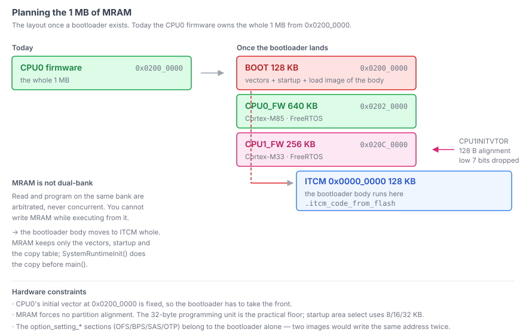
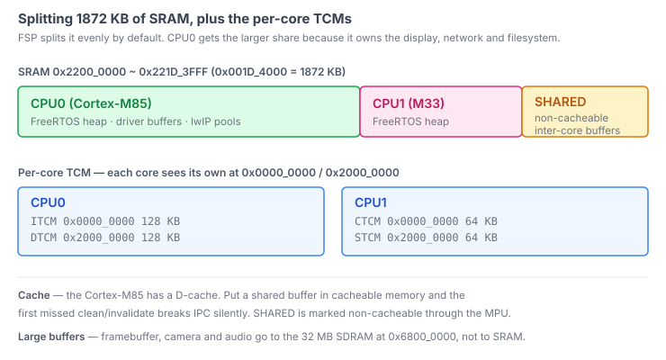

Before splitting memory between two cores on the Titan Mini board, two questions
needed answers. How much SRAM does the `R7KA8P1KFLCAC` actually have? And can I
write MRAM while running code out of it?

Neither answer was where I expected.

## Three sources, three sizes

| Source | Value |
|---|---|
| DFP device pack | `0x1A_0000` — 1664 KB |
| Datasheet | "1664 KB user SRAM" |
| Generated linker script | `0x1D_4000` — **1872 KB** |

That is a 208 KB gap, which is not a rounding disagreement. The generated linker
script is the odd one out, and it is also the one that is right.

The hardware manual's memory map settles it:

```
0x2200_0000 ~ 0x2219_FFFF   S0BI/S1BI/S2BI/S3BI   1664 KB
0x221A_0000 ~ 0x221D_3FFF   S0BI/S1BI/S2BI/S3BI    208 KB
```

Two entries, contiguous, no hole between them. Together they are `0x1D_4000`, or
1872 KB. The device pack and the datasheet simply stop counting after the first
block.

So the linker gets `0x1D_4000`. Trusting the datasheet would have left 208 KB —
more than the entire CPU1 allocation — sitting unused and invisible.

## MRAM has one bank, and that decides a lot

The RA8P1 uses MRAM rather than flash for code storage. Most of its properties
are comfortable: a 32-byte programming unit as FSP drives it, ECC that corrects
double-bit and detects triple-bit errors, and no erase step.

One property is not comfortable. From the manual's section on parallel
accessibility:

- Background operation works **only between different MRAM banks**.
- Read and program on the same macro are arbitrated and never run at the same time.
- During programming, an interrupt or exception cannot fetch its vector from code MRAM.

The RA8P1 has exactly one bank. So background operation is not available at all,
and writing MRAM while executing from MRAM is not merely discouraged — it cannot
work. The instruction fetch is blocked until programming finishes, which means
the polling loop waiting for that programming cannot fetch its own next
instruction.

**Any code that writes MRAM has to run from RAM.** For the bootloader that is not
a detail to handle later; it is the shape of the thing. The body moves into ITCM
whole, and MRAM keeps only the vectors, the startup code and the copy table.



## The linker already knows how to do that

I expected to write a boot stub that copies itself. It turns out FSP's generated
linker script already defines load-from-MRAM, run-from-RAM sections:

`src/lib/ra_sdk/cm85/fsp_gen.ld`

```
__itcm_from_flash$$ : { *(.itcm_from_flash) *(.itcm_code_from_flash) } > ITCM AT > FLASH
__dtcm_from_flash$$ : { *(.dtcm_from_flash) *(.dtcm_code_from_flash) } > DTCM AT > FLASH
__ram_from_flash$$  : { *(.ram_from_flash)  *(.ram_code_from_flash)  } > RAM  AT > FLASH
```

[Source at commit e0b0dcf](https://github.com/chcbaram/titan-mini/blob/e0b0dcf1cc8f503b62323c9668f18656d4df1211/firmware/ra8p1-fw/src/lib/ra_sdk/cm85/fsp_gen.ld)

The `$$Base` / `$$Limit` / `$$Load` symbols land in the BSP's copy table, and
`SystemRuntimeInit()` performs the copy inside `SystemInit()`, before `main()`.
It is the same mechanism that initialises `.data`.

Which means the whole thing reduces to an attribute on the source:

```c
#define BOOT_CODE   __attribute__((section(".itcm_code_from_flash")))
```

The remaining MRAM rules are the usual ones: no frequency change or standby
transition while programming, and a barrier plus flush plus completion wait after
a write. To avoid stalling the CPU on that wait, poll `MRCPS.PRGBSYC` rather than
issuing a dummy read.

## The partition plan

MRAM gets three regions once the bootloader exists. Today the CPU0 firmware owns
all of it.

| Region | Start | Size |
|---|---|---|
| BOOT | `0x0200_0000` | 128 KB |
| CPU0_FW | `0x0202_0000` | 640 KB |
| CPU1_FW | `0x020C_0000` | 256 KB |

Two alignment facts pin the ends down. CPU0's initial vector at `0x0200_0000` is
fixed in hardware, so the bootloader has to be first. And `CPU1INITVTOR` discards
its low seven bits, so CPU1's vector table must be 128-byte aligned — which is
why CPU1 sits at a round `0x020C_0000` rather than wherever CPU0's image happens
to end. MRAM itself forces no partition alignment; the 32-byte programming unit
is the practical floor.

SRAM is split unevenly on purpose.



FSP's default is an even split, but CPU0 carries the display, the network stack
and the filesystem, so it gets the larger share. The inter-core buffer sits in a
separate region marked non-cacheable through the MPU — the Cortex-M85 has a
D-cache, and a shared buffer in cacheable memory breaks IPC the first time a
clean or invalidate is missed, silently.

On top of that each core has its own TCM, and both see their own at the same
addresses: CPU0 gets 128 KB each of ITCM and DTCM, CPU1 gets 64 KB each of CTCM
and STCM.

Large buffers — framebuffer, camera, audio — do not go in SRAM at all. They go to
the 32 MB SDRAM at `0x6800_0000`.

## One image owns the option settings

The `option_setting_*` sections — OFS0 through OFS3, BPS, SAS and the OTP entries
— matter exactly once, at boot. If two images both emit them, two images write
the same addresses.

So the bootloader owns them, and the application links them out. Right now there
is no bootloader and the CPU0 firmware emits nothing into them, which is why
every one of those sections reads `0 B` in the build output. That is the correct
result, not a missing step.

## Where it stands

The numbers above are in one header, and the per-core linker scripts are narrowed
from it rather than from the generated defaults — CPU0's script now says
`FLASH_LENGTH = 0x000c0000` and `RAM_LENGTH = 0x00160000` instead of the whole
device.

The bootloader partition sizes are still a draft. They get fixed when the images
have real sizes, and the ITCM relocation gets measured on hardware before any of
it is relied on.

## Links

- [titan-mini](https://github.com/chcbaram/titan-mini)
- [Waking the Second Core Is Easy. Knowing It Woke Is Not.](../waking-the-second-core/)
- [Firmware development notes](https://github.com/chcbaram/titan-mini/tree/e0b0dcf1cc8f503b62323c9668f18656d4df1211/firmware/docs) (Korean)

<!--
sources (commit e0b0dcf1cc8f503b62323c9668f18656d4df1211):
- firmware/docs/02-memory-map.md — 전체, 특히 2절(SRAM 크기), 3절(MRAM 특성), 4~5절(파티션), 7절(옵션 설정)
- firmware/ra8p1-fw/src/lib/ra_sdk/cm85/fsp_gen.ld, memory_regions.ld
- mram-layout.svg, sram-partition.svg — 저장소 firmware/docs/images/ 의 같은 이름 그림을
  옮겨 그린 것. 라벨을 영어로 바꿨고, 원본의 "실사용 4,764 B" 는 낡은 값이라 뺐다.
-->
