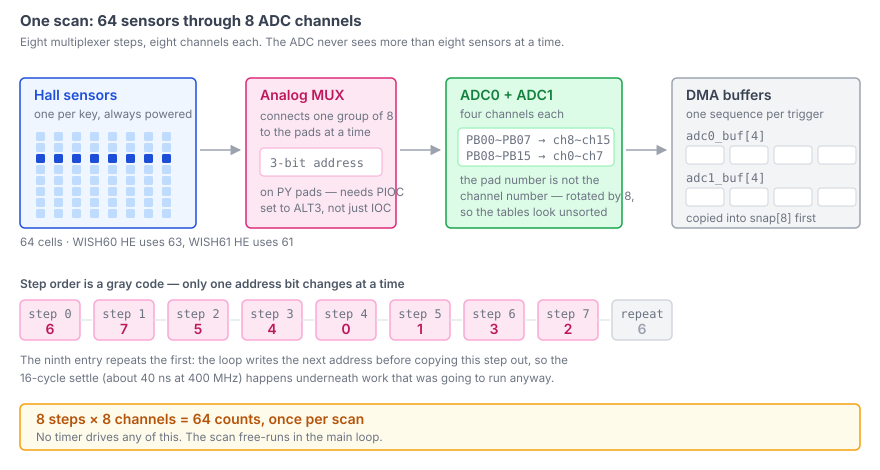
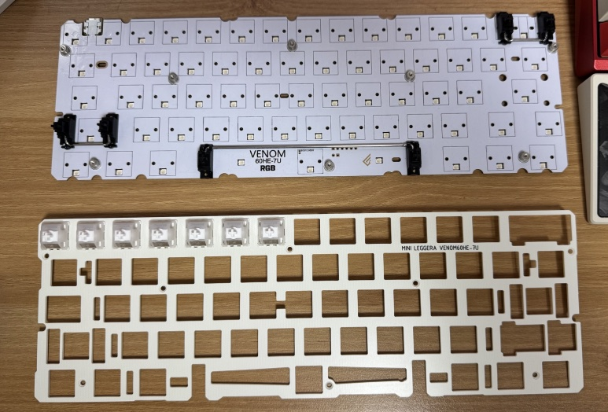
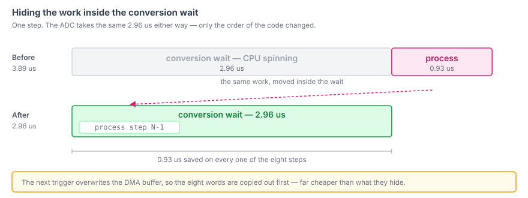
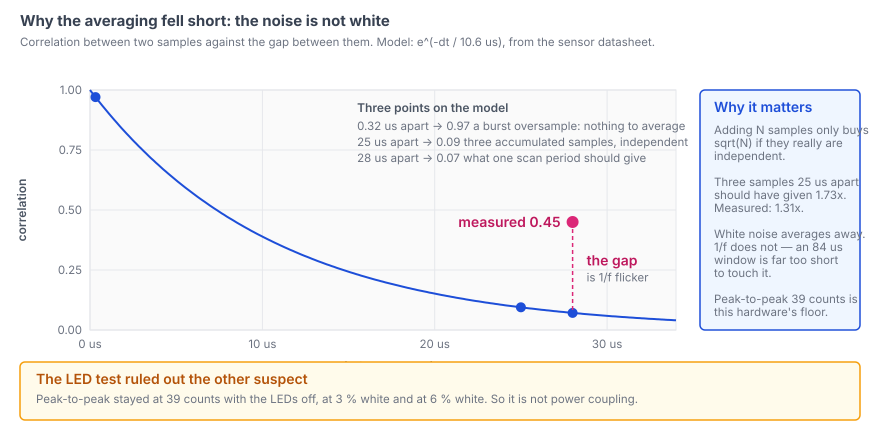
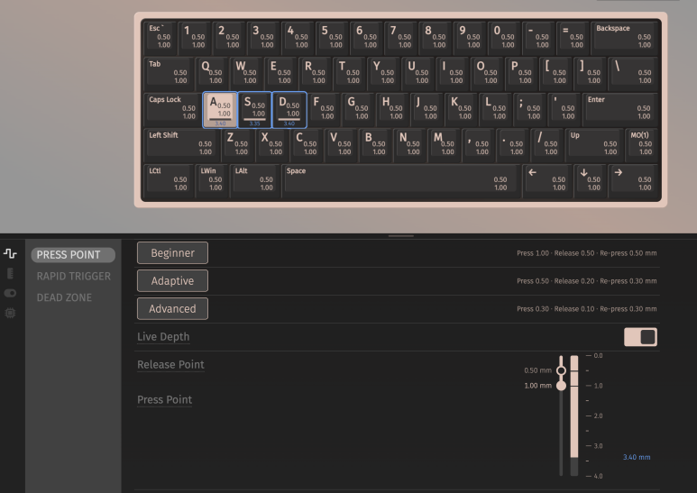
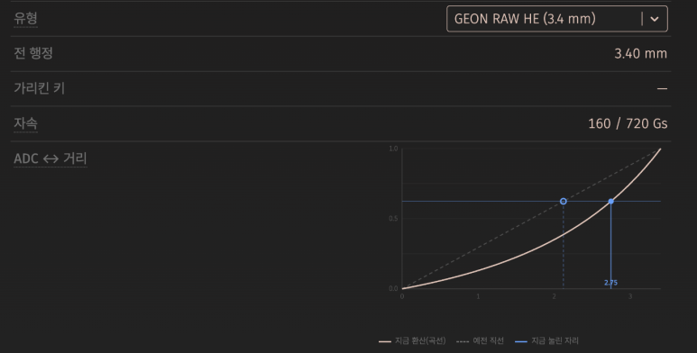
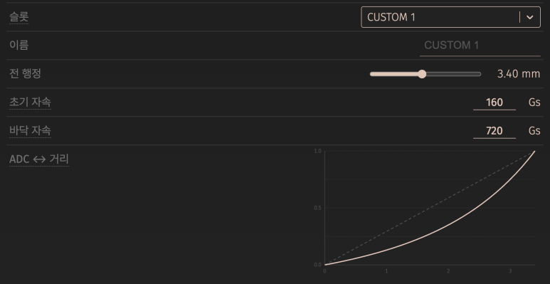
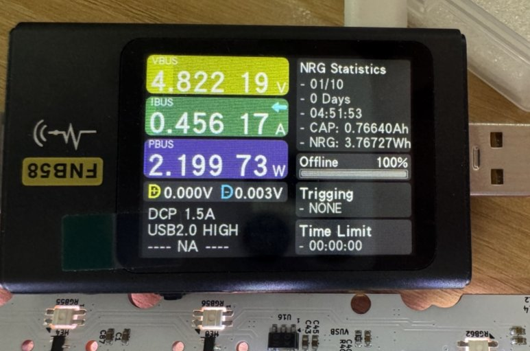

`wish-he` 는 시판 홀이펙트 키보드에 올리는 커스텀 펌웨어다. HPM5361(RISC-V, 400 MHz)
에서 돈다. 훑을 스위치 매트릭스가 없다. 키마다 홀 센서가 하나씩 깔려 있고 그 출력이
스위치 안 자석과의 거리에 따라 움직인다. 그래서 "이 키가 눌렸나" 는 아날로그 전압으로
시작한다.

이 글은 그 전압을 숫자로 바꾸는 계층에 대한 것이다. 채널을 어떻게 다중화하는지, ADC
시퀀서가 설정한 대로 안 도는 지점은 어디인지, 잡음 바닥이 결국 어디였는지. 밀리미터로
바꾸는 것, 눌림 판정, 그 결과를 QMK 매트릭스에 넘기는 것은 전부 이 위층이고 각각 다른
글이다.

## 보드가 주는 것

아날로그 패드 여덟 개가 ADC 블록 둘로 들어간다. ADC0 에 네 채널, ADC1 에 네 채널이다.
그리고 3비트 MUX 주소가 센서 여덟 개짜리 묶음 중 어느 것을 붙일지 고른다. 채널 8 ×
스텝 8 = 64칸이고, WISH60 HE(7U) 가 63개, WISH61 HE 가 61개를 쓴다.

핀 배치에서 두 가지가 시간을 잡아먹었다. 표본 하나가 제대로 나오기 전의 일이다.

**ADC 채널 번호는 패드 번호가 아니다.** `PB00~PB07` 이 `ch8~ch15` 로, `PB08~PB15` 가
`ch0~ch7` 로 간다. 여덟 칸 돌아가 있어서 시퀀스 표가 정렬돼 있지도, 이어져 있지도
않다.

**MUX 주소를 나르는 `PY` 패드는 `IOC` 뿐 아니라 `PIOC` 도 ALT3 으로 잡아야 한다.**
안 그러면 그 패드는 SoC 에 아예 안 물린다.

이 중 어느 것도 문서로 오지 않았다. 남의 제품이라, 센서가 돌아가 있다는 것도 MUX 배선도
보드를 보고 알아냈다. 이 코드가 생기기 전의 일이다.





## 스캔 루프

`firmware/wish-he/src/hw/driver/keys.c`
([퍼머링크](https://github.com/chcbaram/wish-he/blob/2d5083019c522b35f0fe0d7c4f6d8df51b99d22f/firmware/wish-he/src/hw/driver/keys.c#L51-L54))

```c
static const uint8_t mux_addr[KEYS_STEP_MAX + 1] =
{
  6, 7, 5, 4, 0, 1, 3, 2,   6
};
```

저 한 줄에 판단 둘이 들어 있다.

순서가 그레이 코드다. 스텝마다 주소 비트가 하나씩만 바뀌어서 이웃 채널 사이 간섭이
작다.

그리고 아홉 번째 원소가 첫 번째를 되풀이한다. 루프가 이번 스텝 결과를 읽기 **전에**
다음 주소를 쓰기 때문이다. 그러면 스텝 N+1 의 세틀링이 스텝 N 의 처리와 겹쳐서 공짜가
된다. 세틀링은 16 사이클, 400 MHz 에서 40 ns 쯤이다. 타이머는 없다. 스캔은 메인
루프에서 자유 주행한다.

## 이름이 거짓말하는 레지스터 둘

시퀀서에서 첫 변환을 받아내는 데 "완료 인터럽트가 영영 안 온다" 를 두 번 겪었다. 둘 다
필드 이름을 믿어서 생긴 일이다.

`SEQ_INT_EN` 은 "시퀀스 완료 인터럽트를 쓰겠다" 로 들려서 전부 `false` 로 뒀다. 그런데
이건 큐 원소마다 붙는 것이고 뜻은 *이 원소가 끝나면 알려라* 다. 하나도 안 켜면
`SEQ_CMPT` 가 아예 안 뜬다. 스캔 174번에 타임아웃 174번이었다.

`CONT_EN` 은 "계속 반복" 으로 들려서 껐다. 매뉴얼의 뜻은 *한 번 트리거하면 끝
(seq_len) 까지 큐를 계속 처리한다* 다. 꺼 두면 트리거 한 번에 채널 하나만 변환하고
멈춘다. DMA 버퍼에 진짜 값 하나와 손 안 댄 셋이 들어 있었다. 반복은 `RESTART_EN`
이고, 그것도 `CONT_EN` 과 같이 켜야 동작한다.

`firmware/wish-he/src/hw/driver/keys.c`
([퍼머링크](https://github.com/chcbaram/wish-he/blob/2d5083019c522b35f0fe0d7c4f6d8df51b99d22f/firmware/wish-he/src/hw/driver/keys.c#L1584-L1596))

```c
seq_cfg.cont_en    = true;
seq_cfg.restart_en = false;
for (uint32_t i = 0; i < KEYS_SEQ_LEN; i++)
{
  seq_cfg.queue[i].ch = seq_ch[i];

  /*
   * ★ SEQ_INT_EN 은 시퀀스 전체가 아니라 "이 큐 원소가 끝나면 알려라" 다.
   *   전부 false 로 두면 완료 인터럽트가 영영 오지 않는다 (스캔이 통째로 타임아웃).
   *   마지막 원소에만 켜서 시퀀스 끝에 한 번만 받는다.
   */
  seq_cfg.queue[i].seq_int_en = (i == (KEYS_SEQ_LEN - 1));
}
```

## "변환이 끝났다" 와 "버퍼에 앉았다" 는 다른 사건이다

그렇게 싸워서 얻은 완료 인터럽트는 지금 펌웨어에 없다. 스캔마다 ISR 16번, 초당 24만
번이 들어오는데 하는 일이 플래그 세우기뿐이면, 상태 레지스터를 직접 읽는 것만
못하다.

그다음엔 그 플래그도 없앴다. 틀린 질문에 답하고 있었기 때문이다. `SEQ_CMPT` 는 마지막
채널이 **변환을** 끝냈다는 뜻이지, 그 값이 버스를 건너 DMA 버퍼에 앉았다는 뜻이 아니다.
`-O0` 에서는 플래그와 읽기 사이 코드가 충분히 느려서 그 틈이 가려져 있었다. `-O2`
에서는 아니었다. 각 시퀀스의 마지막 원소인 `ch3` 과 `ch7` 이 **이전 스텝의 값**을 읽기
시작했다. 그 두 칸의 피크투피크 잡음이 12 와 231 카운트였다. 다른 칸은 3~9 였다.
게다가 MUX 는 이미 움직인 뒤라 그 묵은 값은 **다른 키의 것**이다. 증상은 엉뚱한 키가
입력되는 것으로 나타났다.

DMA 워드의 `cycle_bit` 플래그가 답처럼 보였는데 아니었다. 소프트웨어 트리거가 시퀀스를
0번 원소부터 다시 시작시켜서 포인터가 감기지를 않는다. 수백만 번 스캔한 뒤에도 네 워드
전부 bit31 이 0 이었다.

그래서 트리거 전에 **마지막 칸을 0 으로 비우고** 그 칸을 본다. 칸은 순서대로 차고,
진짜 DMA 워드는 자기 채널 번호를 달고 있어서 0 이 될 수 없다.

`firmware/wish-he/src/hw/driver/keys.c`
([퍼머링크](https://github.com/chcbaram/wish-he/blob/2d5083019c522b35f0fe0d7c4f6d8df51b99d22f/firmware/wish-he/src/hw/driver/keys.c#L1676-L1701))

```c
static inline void keysDmaArm(void)
{
  adc0_buf[KEYS_SEQ_LEN - 1] = 0;
  adc1_buf[KEYS_SEQ_LEN - 1] = 0;
}

static inline bool keysWaitDma(void)
{
  uint32_t spin = 0;

  while (adc0_buf[KEYS_SEQ_LEN - 1] == 0 || adc1_buf[KEYS_SEQ_LEN - 1] == 0)
  {
    if (++spin > KEYS_WAIT_LIMIT)
    {
      timeout_cnt++;
      return false;
    }
  }
  return true;
}
```

보통은 비교 한 번으로 끝난다. DMA 쓰기가 변환보다 먼저 일어날 수는 없으니, 나중 사건을
기다리면 앞 사건은 저절로 덮인다. `SEQ_CMPT` 폴링을 뺀 것만으로 스캔당 4.5 us 가
줄었다. 버퍼에는 `volatile` 도 붙여야 한다. `ATTR_PLACE_AT_NONCACHEABLE_BSS` 는 이미
붙어 있었지만 그건 하드웨어 캐시 이야기지 컴파일러 이야기가 아니다.

## 죽어 있는 시간 채우기

변환은 스텝당 2.96 us 고, 예전에는 CPU 가 그걸 통째로 기다린 다음 0.93 us 를 처리에
썼다. 스텝 N 을 트리거해 놓고 그 대기 안에서 스텝 N-1 을 처리하면 처리 시간이 통째로
숨는다. 다음 트리거가 DMA 버퍼를 덮어쓰므로 여덟 워드를 먼저 복사해 두는데, 그 값이
숨기는 것에 비하면 훨씬 싸다.



`firmware/wish-he/src/hw/driver/keys.c`
([퍼머링크](https://github.com/chcbaram/wish-he/blob/2d5083019c522b35f0fe0d7c4f6d8df51b99d22f/firmware/wish-he/src/hw/driver/keys.c#L2862-L2893))

```c
gpio_write_port(HPM_GPIO0, KEYS_MUX_GPIO_PORT, mux_addr[step]);
keysSettle();

/* 마지막 칸을 비워 둔다 — 여기가 채워지면 이번 스텝의 값이 다 온 것이다 */
keysDmaArm();

adc16_trigger_seq_by_sw(HPM_ADC0);
adc16_trigger_seq_by_sw(HPM_ADC1);

/* ── 여기부터 변환이 끝날 때까지가 공짜 시간이다 ── */
if (has_hold)
{
  for (uint32_t i = 0; i < KEYS_CH_MAX; i++) keysFilter(hold, i, snap[i]);
  if (is_calibrated) keysTrack(hold);
}

/* DMA 기록이 곧 변환 완료다 — 한 번만 기다린다 */
if (keysWaitDma() == false)
{
  ret      = false;
  has_hold = false;      /* 이번 값은 못 믿는다 */
  break;
}

/* ★ 다음 주소를 결과 뜨기 전에 — 세틀링이 복사와 겹친다 */
gpio_write_port(HPM_GPIO0, KEYS_MUX_GPIO_PORT, mux_addr[step + 1]);

for (uint32_t i = 0; i < KEYS_SEQ_LEN; i++)
{
  snap[i]                = adc0_buf[i];
  snap[KEYS_SEQ_LEN + i] = adc1_buf[i];
}
```

바뀐 건 순서뿐이다. ADC 설정도 잡음도 그대로다.

## 예산

순서를 바꾸기 전에는 한 바퀴가 32.5 us 였고, 그중 23.72 us 가 변환과 DMA 도착이었다.
루프가 손댈 수 없는 하드웨어 시간이다. 마지막으로 잰 값은 wish61-he 에서 한 바퀴
26 us, 초당 37,494 바퀴다. USB 폴링이 8 kHz, 125 us 니까 스캔은 예산 안에 넉넉히
들어간다. 그래서 자유 주행하게 두고 USB 완료 콜백이 최신 값을 보내는 구조가 된다.

ADC 쪽에서 내가 실제로 돌린 손잡이는 클럭 분주 하나다. ADC 클럭은 AHB0(133 MHz) 를 그
분주로 나눈 것이고, 변환에 `sample_cycle + 21` 클럭이 든다. 후보 셋을 2026-08-17 에 다
재 봤다.

| 분주 | ADC 클럭 | 변환 | 스캔 | 잡음 p-p (평균 / 최대) |
|---|---|---|---|---|
| 4 | 33.3 MHz | 23.75 us | 29 us | 47 / 55 |
| 3 | 44.4 MHz | 19.12 us | 26 us | 42 / 53 |
| 2 | 66.7 MHz | 14.50 us | 25 us | 47 / 63 |

4에서 3으로 가면 스캔이 13 % 빨라지고 **잡음도** 11 % 낮아진다. 2로 가면 얻는 게 거의
없으면서 최악값이 나빠진다. SAR 이 세틀링 여유를 잃는 모양으로 읽힌다. 66.7 MHz 는
12비트 4 MSPS 라는 공표값에서 역산한 약 56 MHz 를 넘고, 44.4 MHz 는 26 % 여유를 남긴다.

## 잡음 바닥은 내가 고칠 수 있는 게 아니었다

표본 조리개를 5 사이클에서 16 사이클로 넓히고 60초씩 두 번, 약 150만 스캔을 쟀다.
피크투피크 잡음이 두 번 다 47 이었고 스캔만 34 % 느려졌다. 그러니 바닥은 샘플홀드
세틀링도 소스 임피던스도 아니다.

다음 용의자는 LED 였다. 83개가 보드 전원을 같이 쓴다.

| LED 부하 | 잡음 p-p |
|---|---|
| 꺼짐 | 39 |
| 백색 3 % (~156 mA) | 39 |
| 백색 6 % (~312 mA) | 39 |

꿈쩍하지 않는다. 전원 결합이 아니다. 이 세 줄 뒤에는 60초 조리개 시험 같은 정해진 절차가
없었다. 피크투피크 값이 실시간으로 보이니까, LED 를 켜면 그 숫자가 움직이거나 안
움직이거나 둘 중 하나인데 안 움직였다.

그러면 남는 설명은 센서 자신의 **1/f 플리커 잡음** 하나다. 백색 성분은 스캔을 거치며
평균으로 지워지지만 1/f 는 상관 시간이 길어서 84 us 짜리 창으로는 손도 못 댄다. 실측
상관계수와 맞는다. 연속 스캔 사이가 0.45 인데, 백색 잡음만이라면 0.07 이어야 한다.



평균 쪽에서 봐도 같은 이야기가 나온다. 최근 표본 셋을 더하면 잡음이 √3 = 1.73배 좋아져야
하는데 실측은 1.31배였다. 평균이 아니라 **합**으로 들고 있는다. 3으로 나누면 눈금이
12비트로 되돌아가면서 개선분이 양자화로 날아간다. 합으로 두면 0~12285 로 약 13.6비트다.
그리고 **이동합**이라 스캔마다 가장 오래된 표본을 빼고 새 것을 더한다. 판정 횟수가
1/3 로 줄지 않는다.

피크투피크 39 가 이 하드웨어의 바닥이다. 더 누적해도 비례해서 좋아지지 않는다.



## 밀리미터가 아니라 카운트

이 계층은 거리를 모른다. 내 보드에서 안 눌린 칸이 누적 눈금으로 7,474~8,383 을 읽고,
전 행정이 61키 평균 약 2,514 카운트다. 이 숫자들은 이 보드의 아날로그 경로에서 나온
것이라 남의 장비와 맞을 이유가 없다. 모든 판정은 키별 기준값에서의 **차이**로 한다.
잔물결을 걸러내려고 데드밴드를 12 카운트 두는데, 그 폭보다 큰 변화는 같은 표본 안에서
드러나므로 데드밴드가 지연을 만들지 않는다.

그 차이를 밀리미터로 바꾸려면 스위치의 자속-거리 곡선과 키별로 실측한 전 행정이 필요하다.
그건 다음 글이고, 눌림 판정은 그다음이다. 설정 도구에는 이미 그 반대쪽 끝이 들어 있다.
스위치 표에 항목마다 전 행정과 자속 두 값이 있고, 표에 없는 스위치를 직접 넣는 칸도
있다.






## 아직 안 풀린 것

- ADC 를 `adc16_res_12_bits` 로 설정했는데 결과는 16비트 범위 전체(대략 42,000~46,000)
  에 퍼져서 나온다. 그래서 코드가 오른쪽으로 4비트 민다. 해상도 설정이 실제로 무엇을
  바꾸는지 아직 모른다.
- 위의 4 MSPS 여유는 공표된 처리량에서 역산한 것이다. 원래 데이터시트의 ADC 입력 클럭
  최대값을 구하지 못했다.
- 상관 시간 10.6 us 는 이 보드에 달린 홀 센서의 데이터시트에서 온 값이지 내 계측기에서
  나온 값이 아니다. 가볍지 않은 값이다. 1/f 논증 전체가 그 값이 예측하는 것과의 비교
  이기 때문이다.



## 링크

- [wish-he](https://github.com/chcbaram/wish-he)
- [입력지점 위의 유령 입력, 신고 하나에 원인 둘](../wish-he-rapid-trigger/)
- [펌웨어 개발 노트](https://github.com/chcbaram/wish-he/tree/2d5083019c522b35f0fe0d7c4f6d8df51b99d22f/firmware/wish-he/docs)

<!--
sources (commit 2d5083019c522b35f0fe0d7c4f6d8df51b99d22f):
- 영어판 index.md 와 같은 출처. 번역이 아니라 한국어로 다시 썼다.
- 코드 발췌의 주석은 저장소 원본 그대로 한국어다. 영어판은 그것을 번역해 실었다.
- firmware/wish-he/docs/05-adc-scan.md — 스캔 구조, SEQ_INT_EN/CONT_EN 함정, 그레이 코드,
  조리개 시험, LED 부하 시험, 잡음 바닥
- firmware/wish-he/docs/00-hardware.md — 핀맵, ADC 채널 회전, PIOC ALT3, 전류 예산
- firmware/wish-he/docs/12-scan-speed.md — 단계 분해, "변환 끝 != 버퍼에 앉음", volatile, cycle_bit
- firmware/wish-he/docs/13-rapid-trigger.md — 겹치기 2.96/0.93 us, 3개 이동합 1.31배, 상관계수 0.45
- firmware/wish-he/src/hw/driver/keys.c — L51-54, L1584-1596, L1676-1701, L2862-2893
- scan-structure.svg, dead-time.svg, noise-correlation.svg — 저장소에 없는 그림이라 직접 그렸다.
  영어판과 같은 파일을 쓴다. 라벨은 영어다.
- 01.jpg, via-*.png, keys-dump-w480.png, usb-meter-w600.jpg — 저자 제공
-->
