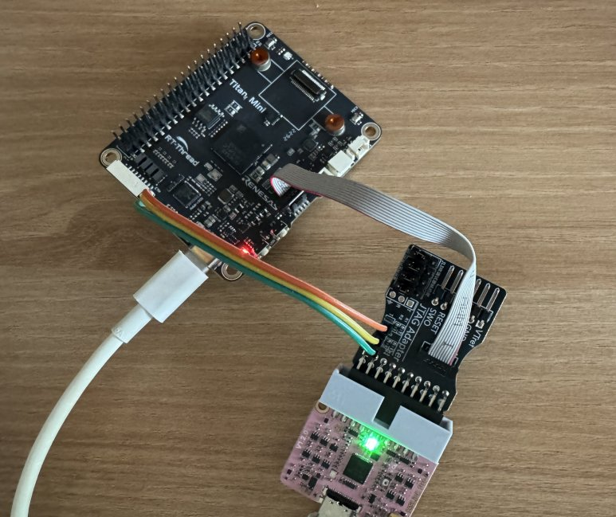

Titan Mini is a board built around the Renesas `R7KA8P1KFLCAC`: a Cortex-M85 at
1 GHz as CPU0, a Cortex-M33 as CPU1, and an Ethos-U55 NPU, in a 289-ball BGA
with 1 MB of MRAM and 1872 KB of SRAM. Before any of that gets interesting, the
project needs a shape. This is the shape I settled on, and the one rule that
holds it together.



That is the whole development setup. Power and the console come in over USB-C,
the ribbon cable goes to the CMSIS-DAP probe that `pyocd` drives, and the red
channel of LED3 is on.

## The layout

```
src/
├── common/     shared by both cores, portable across projects
│   ├── core/       qbuffer, util_core
│   └── hw/include/ public driver APIs — led.h uart.h cli.h
├── cpu/        per-core, hand-written
│   ├── shared/     the contract the two cores must agree on
│   ├── cm85/       CPU0 — main / ap / bsp / hw
│   └── cm33/       CPU1
└── lib/ra_sdk/ vendor — FSP sources and per-core generated output
```

Everything directly under `src/` is a **category**, never an instance. `cm85`
lives inside `cpu/`, not beside it, so adding a third core later does not change
the top level.

The directory is `cpu/` rather than `core/` because `common/core/` already means
something else here, and because FSP itself calls them CPUs — `_RA_CORE=CPU0`.

`cpu/shared/` is for things neither core owns: right now just the shared memory
block layout, later the IPC message definitions. It is not in `common/`, because
`common/` has to survive a change of MCU while this is a contract between two
specific cores on one specific board.

## The one rule

> When the MCU changes, `bsp` and `hw/driver` get rewritten. `ap` and `common`
> do not.

| Layer | Vendor HAL (FSP / CMSIS) | Role |
|---|---|---|
| `ap/` | **forbidden** | application, calls only the public `hw/` API |
| `common/` | **forbidden** | portable code, shared verbatim with other repositories |
| `cpu/shared/` | **forbidden** | the two-core contract |
| `hw/driver/` | allowed | **this is where MCU dependence is contained** |
| `bsp/` | allowed | MCU init, clocks, time |

`ap` calling a `hw` driver is the normal path. What the rule forbids is `ap`
calling `R_IOPORT_PinWrite()` directly.

## The compiler will not enforce it

This is the part worth writing down. The include chain runs
`ap_def.h` → `hw.h` → `hw_def.h` → `bsp.h` → `hal_data.h`, so every FSP symbol
is visible all the way up into `ap`. Nothing fails to compile when the rule is
broken. Relying on discipline alone means it leaks eventually — probably on a
tired evening, definitely without a diff that looks suspicious.

So there is a checker:

`firmware/ra8p1-fw/tools/check_layers.py`

```python
# FSP / CMSIS vendor symbols. Both header names and identifiers are matched.
VENDOR = re.compile(
    r'\b('
    r'R_[A-Z][A-Za-z0-9_]*'       # R_IOPORT_Open, R_PORT1
    r'|FSP_[A-Z_]+'               # FSP_SUCCESS
    r'|fsp_err_t|fsp_[a-z_]+_t'
    r'|BSP_[A-Z0-9_]+'            # BSP_IO_PORT_01_PIN_09
    r'|bsp_[a-z0-9_]+_t'
    r'|g_ioport|g_uart[0-9]+'     # ra_gen instances
    r')\b'
)
```

[Source at commit e0b0dcf](https://github.com/chcbaram/titan-mini/blob/e0b0dcf1cc8f503b62323c9668f18656d4df1211/firmware/ra8p1-fw/tools/check_layers.py#L26-L38)

It walks the forbidden layers looking for those symbols and for vendor headers
like `hal_data.h` or `r_*.h`, and exits 1 on a violation. A rule that only lives
in a document is a rule that is already broken somewhere.

## One LED, to close the loop

The first milestone was not interesting in itself — blink an LED — but it
establishes build → flash → verify, and it is the first thing the layer rule has
to survive.

The board has one RGB LED with its common anode on `+3V3`, so every channel is
**active low**: red on P109, green on P108, blue on P110.

Two consequences fell out of that.

The pin configuration sets `IOPORT_CFG_PORT_OUTPUT_HIGH` as the initial state,
because HIGH is *off* here. Get that backwards and the LED flickers during boot.
It is applied by `R_IOPORT_Open()` inside `R_BSP_WarmStart(POST_C)`, before
`main()` runs, so the driver never touches pin direction.

And the driver is a table, called through the FSP instance's function pointers
rather than the `R_IOPORT_*` symbols directly:

`src/cpu/cm85/hw/driver/led.c`

```c
static const led_tbl_t led_tbl[LED_MAX_CH] =
{
  {BSP_IO_PORT_01_PIN_09, BSP_IO_LEVEL_LOW, BSP_IO_LEVEL_HIGH},   // LED3 RED
  {BSP_IO_PORT_01_PIN_08, BSP_IO_LEVEL_LOW, BSP_IO_LEVEL_HIGH},   // LED3 GREEN
  {BSP_IO_PORT_01_PIN_10, BSP_IO_LEVEL_LOW, BSP_IO_LEVEL_HIGH},   // LED3 BLUE
};

void ledOn(uint8_t ch)
{
  if (ch >= LED_MAX_CH) return;

  g_ioport.p_api->pinWrite(g_ioport.p_ctrl, led_tbl[ch].pin, led_tbl[ch].on_state);
}
```

[Source at commit e0b0dcf](https://github.com/chcbaram/titan-mini/blob/e0b0dcf1cc8f503b62323c9668f18656d4df1211/firmware/ra8p1-fw/src/cpu/cm85/hw/driver/led.c)

Carrying both `on_state` and `off_state` in the table means an active-high board
needs a different table, not a different driver.

## Where it stands

CPU0 runs at 1000 MHz with FreeRTOS 11.1.0, a CLI over SCI2, and module
registration through a `.module` section. CPU1 has been brought up far enough to
confirm it starts; IPC, cache and an RTOS on that side come later.

Memory is partitioned per core: 768 KB of MRAM and 1408 KB of SRAM for CPU0,
256 KB and 384 KB for CPU1, with 80 KB shared. The current CM85 image uses
38,512 B of flash and 78,340 B of RAM.

Next is GPIO and timers, then MRAM with NVS — which is also where the ITCM
relocation the bootloader design depends on gets measured for real.

## Links

- [titan-mini](https://github.com/chcbaram/titan-mini)
- [Firmware development notes](https://github.com/chcbaram/titan-mini/tree/e0b0dcf1cc8f503b62323c9668f18656d4df1211/firmware/docs) (Korean)

<!--
sources (commit e0b0dcf1cc8f503b62323c9668f18656d4df1211):
- README.md, firmware/docs/README.md — 보드/MCU 사양, 현재 상태, 빌드 크기, 파티션
- firmware/docs/12-project-skeleton.md — 디렉터리, 계층 규칙, 검사기
- firmware/docs/20-led.md — LED 하드웨어, 핀 설정, 드라이버
- firmware/ra8p1-fw/tools/check_layers.py, src/cpu/cm85/hw/driver/led.c
- 01.jpg — 저자가 제공한 디버깅 셋업 사진
-->
