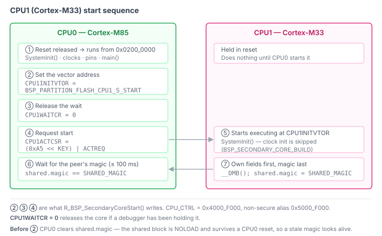

Titan Mini 보드의 RA8P1 에는 코어가 둘 있다. CPU0 가 1 GHz Cortex-M85, CPU1 이
Cortex-M33 이다. CPU1 을 기동하는 건 함수 하나 부르는 일이었다. 진짜로 기동됐는지
알아내는 데는 그보다 훨씬 오래 걸렸고, 도중에 만난 문제 둘은 애초에 내 코드에 있지도
않았다.

## CPU1 이 사는 곳

MRAM 과 SRAM 은 코어별로 나뉜다. 링커 스크립트와 스타트업 코드가 서로 다른 말을 하지
못하도록 숫자는 헤더 하나에 모아 둔다.

| 영역 | 시작 | 크기 |
|---|---|---|
| MRAM CPU0 | `0x0200_0000` | 768 KB |
| MRAM CPU1 | `0x020C_0000` | 256 KB |
| SRAM CPU0 | `0x2200_0000` | 1408 KB |
| SRAM CPU1 | `0x2216_0000` | 384 KB |
| SRAM 공유 | `0x221C_0000` | 80 KB |

CPU1 이 더 편한 자리가 아니라 `0x020C_0000` 에서 시작하는 이유는
`CPU1INITVTOR`(CPU1 의 벡터 주소를 넣는 레지스터) 이 하위 7비트를 버리기 때문이다.
벡터 테이블이 128 바이트 정렬이어야 한다. CPU1 을 *뒤쪽* 에 둔 덕도 있다. 나중에
부트로더가 CPU0 영역 앞에서 128 KB 를 떼 가도 CPU1 은 안 옮겨도 된다.

## 함수 하나, 답은 없음

FSP(Renesas 의 드라이버·설정 생성 프레임워크) 의 멀티코어 API 는
`R_BSP_SecondaryCoreStart()` 하나가 전부다. 레지스터 셋을 쓰고 — 벡터 주소, 대기 해제,
키가 붙은 기동 요청 — `void` 를 반환한다.

두 번째 코어가 기동됐는지, 지금도 돌고 있는지 물어보는 호출은 FSP 어디에도 없다. 코어 간
세마포어와 NMI 요청이 있지만 그건 상호 배제와 알림이지 상태가 아니다.

그러니 답은 만들어야 한다. 아래에 나오는 것들은 전부 저 함수 하나가 아무것도 안 알려
주기 때문에 존재한다.



② ③ ④ 가 저 함수 하나가 쓰는 레지스터 셋이다. 실제로 됐는지 알려 주는 ⑥ 과 ⑦ 은 내가
만든 것이고, 이 글의 나머지는 그게 왜 저 모양인지에 대한 이야기다.

## 이게 컴파일이라도 되는지를 정하는 매크로

FSP 는 매크로 하나가 정의돼 있는지로 이 프로젝트가 멀티코어인지 판단한다.

```c
/* fsp/src/bsp/mcu/all/bsp_common.h */
#if defined(BSP_PARTITION_FLASH_CPU1_S_START)
 #define BSP_MULTICORE_PROJECT    (1)
#else
 #define BSP_MULTICORE_PROJECT    (0)
#endif
```

`R_BSP_SecondaryCoreStart()` 가 저 조건 안에 들어 있다. 매크로가 없으면 함수 자체가
없다. 그런데 Renesas 컨피규레이터는 저 파티션 매크로를 "Solution" 프로젝트에만
내보내고, 단독 컨피규레이터로는 Solution 을 헤드리스로 생성할 수 없다. 이 저장소가 쓰는
생성 경로가 바로 그 헤드리스다.

그래서 내가 직접 정의했다. 헤더 하나에 모아 두고, 두 코어의 생성된
`bsp_linker_info.h` 가 그걸 위해 비워 둔 자리에서 인클루드한다. 이름은 컨피규레이터
자신의 틀인 `BSP_PARTITION_<RESOURCE>_<CPU0|CPU1>_<S|NS>_START` 를 따랐다. 나중에
Solution 으로 생성한 빌드와 맞물리게 하려는 것이다.

## 깨울 게 없어도 깨운다

이제 저 매크로가 항상 정의돼 있다. 그 말은 `BSP_MULTICORE_PROJECT` 가 항상 참이라는
뜻이고, CPU1 이미지 없이 빌드할 때도 그렇다. CPU0 는 아무것도 없는 `0x020C_0000` 에서
CPU1 을 성실하게 기동하고 있었다. CPU1 은 지워진 벡터 테이블을 읽고 폴트를 냈다. CPU0
는 결과를 안 기다리니 겉보기에는 멀쩡했다.

빌드 구성을 런타임 판단에 묶어서 고쳤다.

```cmake
-D_HW_DEF_CPU1_IMAGE=$<BOOL:${BUILD_CM33}>
```

정의가 없으면 헤더가 `0` 으로 둔다. **안 깨우는 쪽이 안전한 기본값이다.** 런타임에 벡터
테이블을 검사하는 쪽이 더 일반적이겠지만, 그걸로는 정상 이미지와 예전에 구워 둔 낡은
이미지를 구별 못 한다. 그건 부트로더가 생길 때 CRC 가 붙은 진짜 이미지 헤더로 넘어간다.

## 살아 있는지 아는 법

CPU1 은 공유 SRAM 영역의 구조체로 자기 상태를 보고한다. 두 링커 스크립트가 같은 주소에
배치한다.

`src/cpu/shared/shared.h`

```c
#define SHARED_MAGIC   0x544D5348UL   /* "TMSH" */
#define SHARED_VERSION 2

typedef struct
{
  volatile uint32_t magic;
  volatile uint32_t version;
  volatile uint32_t peer_alive;
  volatile uint32_t peer_tick;

  /* the peer introduces itself; written before magic, never changed after */
  volatile uint32_t peer_clock;              // Hz
  char              peer_name[SHARED_NAME_MAX];
  char              peer_fw_ver[SHARED_VER_MAX];
} shared_t;
```

[커밋 e0b0dcf 의 소스](https://github.com/chcbaram/titan-mini/blob/e0b0dcf1cc8f503b62323c9668f18656d4df1211/firmware/ra8p1-fw/src/cpu/shared/shared.h)

이 섹션은 `NOLOAD`(이미지에 안 싣고 시작할 때 0 으로도 안 지우는 섹션) 다. 그래야만
한다. 안 그러면 나중에 부팅하는 코어가 먼저 부팅한 코어가 써 둔 것을 지운다. 각 코어는
자기 필드만 초기화하고, `magic` 은 `__DMB()`(앞선 메모리 접근이 끝나는 것을 보장하는
배리어) 뒤에 **맨 마지막** 으로 쓴다. 이 순서를 처음에 틀렸을 때 CPU0 는 13억에서
시작하는 카운터를 읽었다.

### 함정: 낡은 매직은 살아 있어 보인다

`NOLOAD` 니까 아무도 안 지운다. 그리고 SRAM 은 CPU0 리셋을 견딘다. 그래서 CPU1 이
없어져도 이전 세션의 매직 워드가 유효해 보이는 채로 남는다. CPU1 파티션을 통째로
`0xFFFFFFFF` 로 지운 뒤에 재 봤다.

```
magic   : 0x544D5348      ← looks valid
alive   : 65303  (+0 / 500ms)
tick    : 8231700 ms  (+0)
```

사실을 말하고 있는 건 `+0` 뿐이었다. 카운터가 안 움직이고 있었다.

고치는 쪽은 CPU0 다. **기동을 요청하기 직전에 `magic` 을 지우고** 그게 나타나기를
기다린다. 그래야 매직이 있다는 게 뭔가를 뜻한다.

```
CPU0   clear magic → request start → wait up to 100 ms for magic
CPU1   initialise own fields → __DMB() → write magic last
```

실측한 확인 시간은 **1 ms** 다.

### 주 코어는 상대 코어의 클럭을 계산할 수 없다

구조체에 `peer_clock` 이 있는 이유는 두 코어가 같은 속도로 안 돌기 때문이다. 분주가
따로다 — `SCKDIVCR2.CPUCK0` 과 `CPUCK1` — 게다가 CPU1 은 클럭 초기화를 아예 건너뛴다.
실측값은 **CPU0 1000 MHz, CPU1 250 MHz** 다. CPU0 가 그걸 유도할 방법이 없으니 CPU1 이
보고한다.

## 프로브가 안 되기 시작했다

CPU1 이 진짜로 돌기 시작하자 굽기가 실패하기 시작했다.

```
AHB-AP#2 ... [0]<e000e000:SCS M33 class=9 designer=43b:Arm part=d21 ...>
CPU core #0: Cortex-M85 r1p1, v8.1-M architecture
Error: <APv1Address@0x106734610 #2 dp=0>
```

내 펌웨어가 아니었다. 디바이스 팩은 프로세서 둘을 선언해 놓고도 각각이 어느 액세스
포트(AP, 디버거가 칩 내부에 붙는 통로) 에 있는지를 말하지 않는다. SVD 경로가 붙은
`<debug>` 요소 하나가 있을 뿐이다. pyOCD 는 그 요소에서 `Pname` 과 AP 번호를 읽는데, 둘
다 없으면 첫 프로세서를 AP#0 에 맵핑하고 끝낸다. AP#2 에 Cortex-M33 이 나타나는 순간
조회가 `KeyError` 를 낸다.

CPU1 이 자고 있는 동안에는 AP#2 가 응답을 안 해서 문제가 숨어 있었다.

팩에 두 줄 넣어서 고쳤다. AP 번호는 실제로 스캔해서 얻었다.

```xml
<subFamily DsubFamily="RA8P1_1M_DualCore">
  <debug Pname="CPU0" __ap="0"/>
  <debug Pname="CPU1" __ap="2"/>
```

RA8P1 을 올리다가 두 번째 코어가 돌기 시작한 날 프로브가 죽는다면, 자기 코드를 의심하기
전에 여기를 먼저 보는 게 낫다.

## 하나 더: CPU1 은 핀을 갖지 않는다

CPU1 쪽 설정에는 핀 설정이 아예 없다. 모든 핀은 CPU0 가 설정한다. CPU1 이 쓰는
페리페럴의 핀까지 그렇다. FSP 의 secondary 빌드는 핀 보안 속성 레지스터에 대입하지 않고
AND 만 한다. CPU0 가 허용한 범위를 좁힐 수는 있어도 넓히지는 못한다는 뜻이다. 핀
소유권을 두 컨피규레이터로 나누면 서로 맞아야 하는 파일이 둘이 되고, 그걸 강제하는 건
아무것도 없다.

## 지금 어디까지

CPU1 이 부팅해서 자기 이름과 펌웨어 버전과 클럭을 보고한다. CPU0 는 언제든 블로킹 없이
아직 돌고 있는지 물어볼 수 있다. 공개 인터페이스는 함수뿐이고, 이름도 `cpu1` 이 아니라
일반적인 상대 코어를 가리키게 지었다. 같은 헤더가 듀얼 코어 STM32 나 RP2040 에서도
쓰인다.

코어 간 메시징, 캐시 일관성, CPU1 쪽 RTOS 가 다음이다. 지금 CPU1 의 일은 자기가 거기
있다는 걸 증명하는 것이다.

## 링크

- [titan-mini](https://github.com/chcbaram/titan-mini)
- [펌웨어 뼈대를 세우고, LED 하나로 확인하기](../titan-mini-firmware-skeleton/)
- [펌웨어 개발 노트](https://github.com/chcbaram/titan-mini/tree/e0b0dcf1cc8f503b62323c9668f18656d4df1211/firmware/docs)

<!--
sources (commit e0b0dcf1cc8f503b62323c9668f18656d4df1211):
- 영어판 index.md 와 같은 출처. 번역이 아니라 한국어로 다시 썼다.
- 용어 방침: 바로 안 읽히는 말은 첫 등장에 괄호로 뜻을 붙인다 (CPU1INITVTOR, FSP,
  NOLOAD, __DMB, 액세스 포트). 저장소 한국어 문서의 낱말이라고 무조건 따르지 않는다.
- firmware/docs/23-cm33-boot.md — 파티션, 매크로, 기동, 공유 블록, pyOCD/DFP, 핀
- firmware/docs/04-dualcore.md, 02-memory-map.md — 코어 구성과 주소 공간
- firmware/ra8p1-fw/src/cpu/shared/shared.h, src/common/hw/include/ipc.h, src/cpu/cm85/hw/driver/ipc.c
- dualcore-start.svg — 영어판과 같은 그림을 쓴다. 라벨은 영어다.
-->
