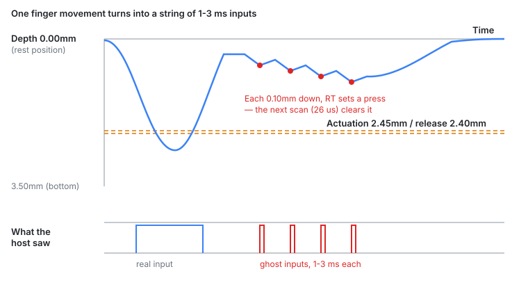

`wish-he` is custom firmware for commercial Hall-effect keyboards. It runs on an
HPM5361 (RISC-V, 400 MHz) and ports QMK/VIA with as little change as possible: only
the key decision is swapped out underneath, and QMK's matrix layer is handed the
result. Hall-effect switches report depth rather than on/off, which is what makes
rapid trigger possible — a key is judged by **how far the direction reversed**, not
by a fixed point on the stroke.

On 2026-08-31 a user filed [issue #2](https://github.com/chcbaram/wish-he/issues/2)
against firmware `v260829R1` on a 61-key HE board. With actuation at 2.45 mm and
release at 2.40 mm, pressing a key again without fully releasing it produced a very
short input — 1 to 3 ms — well above the actuation point. Turning continuous rapid
trigger on did not help; the press still would not hold.

One report, two causes — and an awkward way they interact.

## How the decision runs

Every scan, each key gets a depth `d` in counts. `keysTrack()` has two branches.
While the key is pressed it follows the deepest point reached (`peak`); while it is
released it follows the shallowest. Rapid trigger releases when `peak - d` passes a
threshold and presses again when `d - peak` does. Alongside those sit the two
absolute thresholds the user configures: the actuation point and the release point.

The incoming side had already learned to keep those two ideas apart. An earlier
version tied rapid trigger and the absolute actuation point together with `or`, and
holding a key to the bottom and letting it up produced a stream of repeats
(`ffffffffffffff`). While rapid trigger is armed, the absolute actuation point is
now not consulted at all.

The outgoing side never got the same treatment.

## Cause A — the press is erased one scan later

Rapid trigger says "0.10 mm down, so that is a press". The absolute release point
says "shallower than 2.40 mm, so that is a release". With the reporter's settings,
almost the whole stroke is above the release point, so both fire on the same key,
one scan apart. The press stands for a single scan — 26 us — and drops.



That also explains why it was intermittent. The pressed flag is up for 26 us and
QMK samples the matrix far less often, so it only reaches the host when the windows
overlap.

It stayed hidden because of the defaults. At actuation 1.00 mm and release
0.50 mm, a rapid-trigger re-press usually lands *deeper* than 0.50 mm, so the
absolute release never gets a turn. The line itself is old — unchanged since commit
`2c1958e`, so it was in the reported firmware too.

## The fix for A: change what it compares against, not whether it runs

`firmware/wish-he/src/hw/driver/keys.c`
([permalink](https://github.com/chcbaram/wish-he/blob/2d5083019c522b35f0fe0d7c4f6d8df51b99d22f/firmware/wish-he/src/hw/driver/keys.c#L2689-L2704))

```c
uint16_t abs_rel = t->release;

if (rt_active && squelch_cnt[idx] < abs_rel) abs_rel = squelch_cnt[idx];

if (rt_active && !in_bottom &&
    (int32_t)peak[step][c] - d >=
      (int32_t)t->rt_release[keysRtZone(idx, peak[step][c])])
{
  pressed[step] &= (uint16_t)~bit;
  peak[step][c]  = (uint16_t)d;
}
else if (d < (int32_t)abs_rel)            /* absolute release */
{
  pressed[step] &= (uint16_t)~bit;
  peak[step][c]  = (uint16_t)d;
}
```

While rapid trigger is armed, the absolute release should only mean "the key came
back to rest". So it compares against the squelch instead — `KEYS_SQUELCH_UM` is
12, i.e. 0.12 mm, sitting just above a measured noise floor of 0.10 mm. It is a
constant derived from measurement, not a user setting, so its meaning does not move
when somebody drags a slider. If rapid trigger is off, `rt_active` is false and
nothing changes.

Deleting the branch outright was the obvious alternative and it is wrong. If the
re-press distance is shorter than the rapid-trigger release distance, `peak` stays
parked at a shallow depth and the rollback never reaches the threshold. Set
re-press to 0.10 mm and release to 0.50 mm, trigger a press at 0.15 mm, and the key
stays pressed forever even after your hand is off it.

Three other routes were written down and dropped: forcing the release point further
below the actuation point (2.45 / 2.40 is already a legal pair), warning about deep
actuation points in the configurator (values arrive through the VIA channel, the
per-key command and the CLI, so a UI check leaks), and clamping the rapid-trigger
release distance (the screen would then disagree with the device).

## Cause B — non-continuous rapid trigger was continuous

The second half of the report was "why does it trigger up there at all, with
continuous mode off?"

There was exactly one place that disarmed rapid trigger, and it used the rest
position as its reference. So once a key had crossed the actuation point, rapid
trigger stayed alive over the whole stroke until the finger came all the way off —
which is the usual definition of *continuous* rapid trigger. The common convention
is that plain rapid trigger lives only below the actuation point.

The fix moves the boundary to the actuation point, with a margin.

`firmware/wish-he/src/hw/driver/keys.c`
([permalink](https://github.com/chcbaram/wish-he/blob/2d5083019c522b35f0fe0d7c4f6d8df51b99d22f/firmware/wish-he/src/hw/driver/keys.c#L2781))

```c
if (!rt_cont && d < (int32_t)t->rt_arm_lo) rt_arm[step] &= (uint16_t)~bit;
```

`rt_arm_lo` is built once per settings change, not in the hot loop
([permalink](https://github.com/chcbaram/wish-he/blob/2d5083019c522b35f0fe0d7c4f6d8df51b99d22f/firmware/wish-he/src/hw/driver/keys.c#L2445-L2446)):
the actuation point minus `KEYS_RT_ARM_UM` (0.05 mm), floored at the squelch. The
margin is hysteresis — a finger resting exactly on the boundary would otherwise
cross it on noise alone, and the same movement would re-press sometimes and not
others. The floor keeps the old guarantee for anyone who sets a very shallow
actuation point: coming back to rest still disarms.

Binding this to the *release* point was tried earlier and was a mistake — the
release point is something the user can move anywhere, so the rapid-trigger window
moved with it. The actuation point is different: "rapid trigger lives from here
down" is the convention itself.

## The two fixes hide each other

This is the part I did not expect. With B in place, the reporter's own repro no
longer reaches A in non-continuous mode: rapid trigger no longer lives above the
actuation point, and the release point is always shallower than the actuation
point, so the two conditions have nowhere left to meet.

So the test for A runs with continuous rapid trigger on (`t_rt_cont_shallow_hold`),
which is the one mode where both rules still meet — and that is exactly the case
the reporter described when they said continuous mode did not hold either. A is not
optional: for continuous users it is the only fix.

One older test lost its teeth. `t_rt_arm_release` used to expect a re-press at
0.68 mm with actuation at 1.00 mm. Under the new convention rapid trigger is
correctly dead there, so the depth moved into the window. The old bug it was written
for can no longer be caught by it, because the old reference (the release point) is
always shallower than the new one. The test is not weaker; the failure mode is
structurally gone. What it still guarantees is worth keeping: raising the release
point does not eat into the rapid-trigger window.

Both tests were written before the fixes and watched fail first. A test that has
never been red proves nothing.

Both fixes went in on 2026-09-18, flashed and checked on wish61-he, and the issue
is confirmed resolved.

## What it cost

Measured on wish61-he, same procedure both times: flash, `qmk reset`, 60 seconds
idle, read.

| | before | after |
|---|---|---|
| `keys time` track | 11.703 us | 12.543 us |
| `keysUpdate` | 25 us | 26 us |
| scan rate | 38,752 /s | 37,494 /s |
| `keyboard_task` avg | 2 us | 2 us |
| `keyboard_task` max | 47 us | 13 us |
| over 125 us | 0 | 0 |

Track grew by 0.84 us, which over 64 cells is 13 ns per cell, about five clocks at
400 MHz. The 8 kHz budget is 125 us and we use 26, so there is room, but I am
writing the number down anyway. A 3 % drop for one extra branch is a little much —
the threshold table also grew by 2 bytes per key, and I have not separated the two.

## Still unmeasured

- Whether the press really stood for exactly one scan. The test only checks that it
  does not hold; the pulse width was never measured. `keys lat` would do it.
- The 1-3 ms figure comes from the reporter's video, not from my own instruments.
- Whether 0.05 mm of margin is right. Against 40 counts of peak-to-peak noise it
  looks generous, but I never measured it with a finger on the boundary.
- Which switch the reporter had. The report does not say, so the depth axis in the
  diagram above is drawn to a round 3.50 mm; the board I test on travels 3.4 mm.
  Nothing in the analysis turns on the exact number, but the drawing is not their
  switch.

## Links

- [wish-he](https://github.com/chcbaram/wish-he)
- [Issue #2](https://github.com/chcbaram/wish-he/issues/2)
- [Firmware development notes](https://github.com/chcbaram/wish-he/tree/2d5083019c522b35f0fe0d7c4f6d8df51b99d22f/firmware/wish-he/docs) (Korean)

<!--
sources (commit 2d5083019c522b35f0fe0d7c4f6d8df51b99d22f):
- firmware/wish-he/docs/issues/002-rapid-trigger-ghost-input.md — 증상, 원인 A/B, 고친 뒤, 굽기 전후 표, 안 잰 것
- firmware/wish-he/docs/13-rapid-trigger.md — RT 판정 구조, or 버그, rt_arm 경계 세 번, 나가는 쪽
- firmware/wish-he/docs/15-distance-curve.md — 깊이 구역, 스퀄치와 데드존
- firmware/wish-he/docs/06-key-decision.md, README.md, firmware/wish-he/docs/README.md
- firmware/wish-he/src/hw/driver/keys.c — L2689-2704, L2781, L2445-2446, KEYS_SQUELCH_UM, KEYS_RT_ARM_UM
- firmware/wish-he/tools/he_test.py — t_rt_cont_shallow_hold, t_rt_arm_window, t_rt_arm_release
- commits: c622f35, e22c6d3
- ghost-pulse.svg — 저장소 firmware/wish-he/docs/issues/images/002-ghost-pulse.svg 를
  그대로 옮기고 <text> 라벨만 영어로 바꿨다. 그림의 바닥 3.50mm 는 스위치 표의
  Gateron Jade(3.5mm) 와 맞고, 내 보드의 GEON RAW HE(3.4mm) 와는 다르다.
-->
